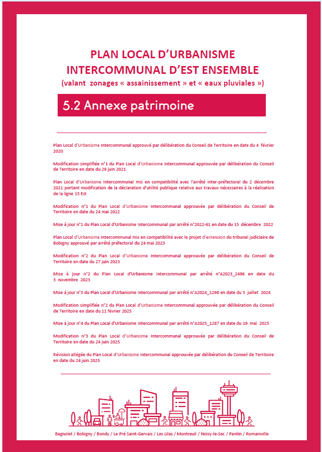
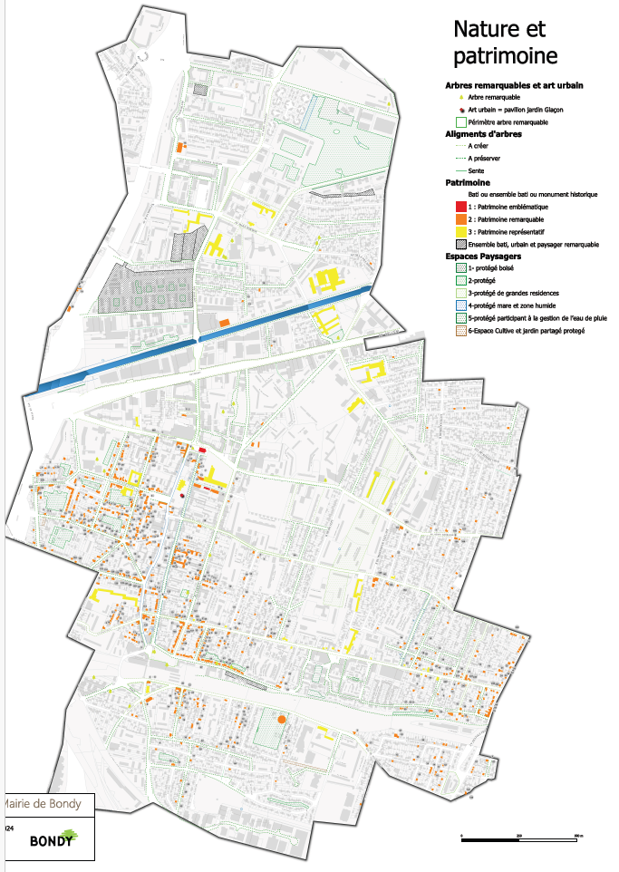
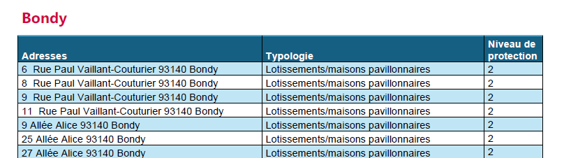
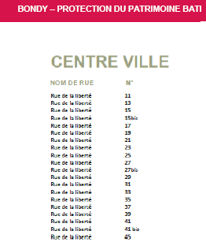
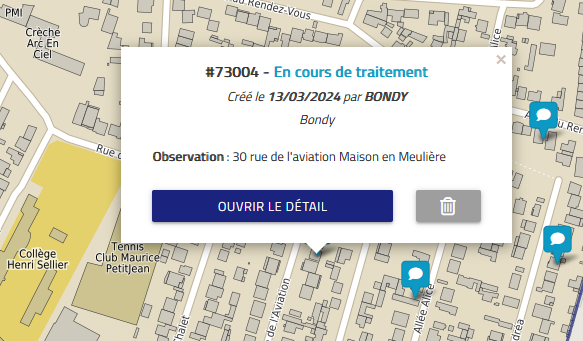
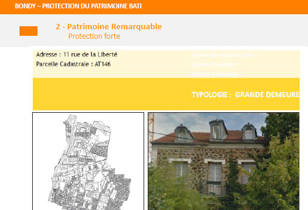
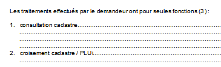
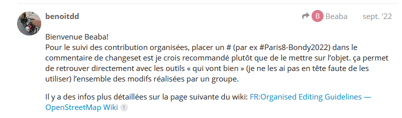
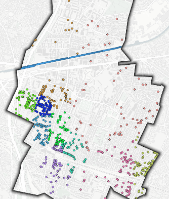

Patrimoine Bondy : du PLUi à OSM

# Différentes sources autour de la construction du PLUi

## Présentation du PLUi et tableau récapitulatif des sources pour le cours

{width="250"}

```{r}
data <- read.csv("data/sources.csv", fileEncoding = "UTF-8")
knitr::kable(data)
```

```{r}
library(sf)
# extraction des couches nécessaire pour la carte 1
patrimoine <- st_layers("data/patrimoine.gpkg")
patrimoine <- patrimoine$name
couches <- c("cadastre","quartier","m3_prescription_surf","geocodageM3")
for (c in couches){
 print(c)
 tmp <- st_read("data/patrimoine.gpkg", c)
 assign(c, tmp)
 st_write(tmp,"data/carte1.gpkg", c, delete_layer=T)
}
st_layers("data/carte1.gpkg")
```

## Le plan du patrimoine issu du PLUi



Toutes les données cartographiques et réglementaires sont en opendata sur le [GPU](https://www.geoportail-urbanisme.gouv.fr/) !

```{mermaid}
flowchart LR
  A[GPU \nprescriptions surf ] --> B(patrimoinePlui)
  B --> C{Distinguer\ntypes}
  C --> D[bâtiments  niveau 1 à 3]
  C --> E[zones]
```

## Les tableaux

Dans le document réglementaire de type .pdf Le document étant opposable, il a fallu ocr-iser les listes

```{r, warning=FALSE}
library(pdftools)
fic <- ("data_raw/5.2 Annexe PatrimoineM3.pdf")
ficSel <- pdf_subset(fic, "data/pdfSel.pdf", pages = c(seq(89,104)))
texte <- pdf_text(ficSel)
texte2 <- strsplit(texte, "\n")
head(texte2 [[1]],10)
```

### Liste de la M3



### Liste de la M2

Il s'agit de la liste des adresses de l'atlas du patrimoine.



## Un outil collaboratif de carto web



## Des fiches scannés et re-scannés



3 livrets (respectivement 269, 467 et 242 pages) issus d'un travail effectué en 2011.

L'ocr-isation ne fonctionne pas sur ce support.

Reprise du titre

```{r}
library(pdftools)
fic <- "data_raw/5.2 Annexe patrimoine (Bondy-livret1).pdf"
ficSel <- pdf_subset(fic, 10, "data/fichePatrimoine.pdf")
texte <- pdf_text(ficSel)
strsplit(texte, "\n")
```

Pour le corps du texte, c'est trop incomplet, même en passant par une transformation en image.

```{r}
library(magick)
library(tesseract)
png <- pdf_convert("data/fichePatrimoine.pdf", dpi = 400)
img <- image_read(png)
# recherche du titre
texte <- ocr(img)
texte2 <- substring(texte, 1, 58)
head(strsplit(texte, "\n"))
texte3 <- gsub("\n|:", "_", texte2)
texte4  <- gsub(" ","_", texte3)
texte5  <- gsub("___","_", texte4)
texte5
```

Une piste intéressante serait de stocker la photo et de la nommer avec l'adresse et le numéro de parcelle.

```{r}
gererPhoto <- function(img){
  taille <- image_info(img)[2:3]
  hauteur <-  taille [2]
  largeur <- taille [1]
  largeur < hauteur
  hauteurPhoto <- hauteur * (100/297 )
  largeurPhoto <- largeur *  (1000/210)
  ht <-  round(hauteur * (160/297),0)
  lg <-  round(largeur * (90/210),0)
  photo <- image_crop(img, geometry = paste0( largeurPhoto,"x", hauteurPhoto-175,"+",lg+50,'+',ht/2.3+5))
  photo <- image_trim(photo)
  image_write(photo, path = paste0("img/", texte5, ".png"), format="png")
}
res <- gererPhoto(img)
image_read(res)
```

## Le cadastre

Extrait de la table local10 des fichiers MAJIC du cadastre 2024

[MCD données cadastrales](https://docs.3liz.org/QgisCadastrePlugin/database/relationships.html)

Chercher la colonne *jannat* dans l'item *Columns*

Spécificité des données MAJIC : elles sont soumises à un acte d'engagement dans lequel sont définies les finalités de traitement.



Une partie du cadastre existe en [opendata](https://cadastre.data.gouv.fr/)

# Les outils

## Le framapad

Il va servir pour la présentation, la répartition des tâches etc... [Framapad Paris 8](https://lite.framacalc.org/9ilj-coursp8)

## OSM

### Définir

Faire une recherche internet pour définir OSM.

Questions :

-   Quelle différence entre openstreetmap.org et openstreetmap.fr

-   Que faut-il retenir des [10 commandements](https://www.openstreetmap.fr/les-10-cosmandements/) ?

Créer son profil sur [openstreetmap.org](https://www.openstreetmap.org), attention au pseudo.

## JOSM

Paramétrage F12 pour lien remote

-   serveur OSM

-   contrôle à distance

## Qgis

Qui connait Qgis ? quel niveau ? (remplir le framapad) =\> définir des étudiants ressource

# Méthode et déroulé

## Le cercle vertueux

Il s'agit de mettre en place un *cercle vertueux* dans l'utilisation d'OSM : extraire, contribuer, vérifier sa saisie en extrayant de nouveau et contribuer pour l'améliorer.

## Déroulé

JOUR 1 : Analyser les données à intégrer dans OSM à partir des sources M3

JOUR 2 : Faire une première session de saisie dans OSM

JOUR 3 : Extraire, faire un atlas sous QGIS bâtiment par bâtiment, utiliser les sources M2 pour faire une deuxième sessions et produire un atlas plus complexe

Au niveau du temps, cela donne :

```{r}
#| echo: true 
# stats temps / séquence
temps <- read.csv("data/tps.csv")
sum(temps$temps, na.rm=TRUE)
```

40 mn de moins... le temps des pauses... 15 mn toutes les 1 H 30, on sera un peu court.

Voir également heures de repas et 1er jour

## Evaluation

::: callout-important
pas d'évaluation officielle
:::

### Deux quizz

-   notions de base puis plusieurs cartes que nous regarderons rapidement

[Introduction](https://framaforms.org/paris8-bondy2025-introduction-1693048391)

-   évaluation de satisfaction

[Évaluation de satisfaction](https://forms.gle/R5W9DooDPMmRn3kF6)

### Cinq cartes

CARTE 1 : compétences de base QGIS, affichage de la donnée Patrimoine du PLUi M3

CARTE 2 : une anomalie rencontrée sur la donnée

CARTE 3 : connaître sa donnée sur sa zone

CARTE 4 : vérif de la 1e saisie et atlas (1 carte et un tableau)

CARTE 5 : vérif de la 2e saisie et atlas plus complexe (plusieurs cartes et un tableau)

### Evaluer la saisie OSM

#### Quantité

Pour la saisie OSM, chaque étudiant notera le nombre de saisies faites

#### Qualité

Concernant la qualité de la saisie, éviter absolument le [retour de bâton OSM](https://forum.openstreetmap.fr/t/landuse-residential-supprime-a-bondy-et-pavillon-sous-bois/9562/9), notamment pour il y a deux ans.

Donc, impérativement mettre dans le commentaire de changeset : **#Paris8-Bondy2025**



Egalement, examiner les contributions dans le détail avec les outils de contrôle de qualité d'OSM : chez [neis](https://resultmaps.neis-one.org/)

## Le collaboratif

Un mot au sujet du collectif, ce cours est aussi l'occasion de tester une organisation de travail en groupe (c'est la raison d'être d'OSM) donc répartition des étudiants cluster de points.



## Précisions techniques

### Support et procédures

Le support, fait sous R Quarto, sert uniquement de "fil rouge".

Les procédures employées sous QGIS / JOSM sont résumées sur un support papier distribué.

### Projet git

En utilisant l'icone à droite du cours, copie du projet GIT en *début* et en *fin* de session (via l'option *download zip*)

### Les données

Directement sur le git ou sur le partage réseau au fur et à mesure.

Partage réseau, au niveau de la zone de recherche, taper

```         
\\C210-P
```

Sélectionner ensuite le répertoire *partage géographie* et *OSM*, clic droit *Ajouter un raccourci rapide*

### Dépôt des cartes

Le dépôt des cartes se fera sur le partage réseau.

Déposer sa carte dans le répertoire *img/cartes* avec comme syntaxe : *prenom.png*

# Présentation en binôme

passé / présent / futur / attentes par rapport OSM / niveau QGIS fichier framapad, celui qui parle, celui qui écrit

sur le [framacalc](https://lite.framacalc.org/9ilj-coursp8)

Ce fichier va permettre de s'attribuer les zones de saisie et toutes les opérations collaboratives du cours.

```{r, eval=FALSE}
data <- read.csv("data/etudiant.csv")
table(data$passé.lieu)
par(mar = c(12,2,2,2))
barplot(table(data$passé.lieu), las = 2)
barplot(table(data$passé.thème), las = 2)
barplot(table(data$présent), las = 2)
barplot(table(data$futur), las = 2)
```

::: callout-important
quelle diffusion des données / du cours ?
:::

# Sitographie

Quelques liens utiles tout au long du cours

[clin d'oeil](https://christophe-lebas.medium.com/tuto-visualiser-une-ville-et-ses-rues-gr%C3%A2ce-%C3%A0-qgis-simplement-avant-den-faire-un-mug-shp-et-a57cf4607f64)

## Qgis

[ze manuel le tuto passage](https://tutoqgis.cnrs.fr/)

une référence en livre : [QGIS Map Design - Second Edition](https://locatepress.com/book/qmd2) d'Anita Graser and Gretchen N. Peterson (2020)

## OSM

### La base

[forum](https://forum.openstreetmap.fr)

[wiki](https://wiki.openstreetmap.org/)

[features](https://wiki.openstreetmap.org/wiki/Map_Features) souvent très lent

[taginfo](https://taginfo.openstreetmap.org/) plus rapide

[overpass](https://overpass-turbo.eu/)

### JOSM

[base](https://learnosm.org/fr/josm/)

[alterzorg](https://www.alterzorg.fr/josm/accueil)

### Le contrôle de qualité

[neiss](http://resultmaps.neis-one.org)

-   notamment [le nombre d'édition par tuile sur Bondy](https://resultmaps.neis-one.org/osm-edits-tile/#14/48.9008/2.4877)

qui permet de remonter sur le détail de chaque contribution par changeset.

[osmose](http://osmose.openstreetmap.fr/fr/map/#zoom=16&lat=48.90695&lon=2.49237)
