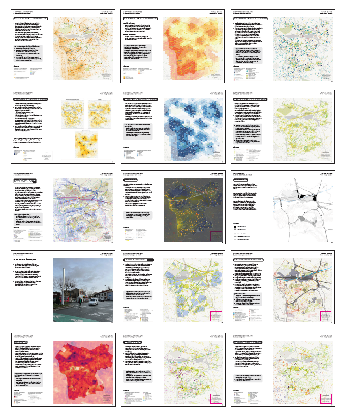

Objectif du cours : saisir le graphe piéton dans OSM pour permettre à tout piéton de le compléter avec street complete

# Brise-glace : présentation en binôme

-   passé / présent / futur / attentes par rapport OSM / niveau QGIS fichier framapad, celui qui parle, celui qui écrit

-   Qui connait Qgis ? quel niveau ? (remplir le framapad) =\> définir des étudiants ressource

sur le [framacalc](https://lite.framacalc.org/9ilj-coursp8)

Ce fichier va permettre de s'attribuer les zones de saisie et toutes les opérations collaboratives du cours.

```{r, eval=FALSE}
data <- read.csv("data/etudiant.csv")
table(data$passé.lieu)
par(mar = c(12,2,2,2))
barplot(table(data$passé.lieu), las = 2)
barplot(table(data$passé.thème), las = 2)
barplot(table(data$présent), las = 2)
barplot(table(data$futur), las = 2)
```

::: callout-important
quelle diffusion des données / du cours ?
:::

# Elements de contexte

## Transition énergétique et marche à pied

Après la *renaturation*, un plan *marchabilité* à Est Ensemble, l'occasion de voir beaucoup de cartes et d'avoir un AMO plein d'idées



## Marchabilité dans OSM

Les vidéos des présentations des SOTM-FR (State Of the Map) permettent d'avoir un état des lieux

vidéos SOTM [2022](https://peertube.openstreetmap.fr/w/scHwjR1TtSAdfpKcrcHY7P) =\> *Les données d'OSM sur le mode piéton et la marchabilité* consultant Montpellier / entreprise Someware [2023](https://peertube.openstreetmap.fr/w/v9AwT6kUxn5ax5W9zzaq3V) =\> *Retour sur l'expérimentation de collecte de données accessibilité du CD94* CD94 loi LOM mise en accessibilité de la voirie [2024](https://peertube.openstreetmap.fr/w/hD9m929abQqKctgw3nnjV8) =\> *Mapper des trottoirs pour l’accessibilité* Lons Le Saunier / Jungle Bus (outil sidewalker) [2025](https://peertube.openstreetmap.fr/w/hghC3My6UQ3GGK68gq57Xy) =\> CD94 Carto'Cité PC Ingénierie et 2 cabinets de géomètre *Du scanner 3D à OSM : le Val de Marne expérimente la production en masse de données d'accessibilité* automatiser le dessin des cheminements piétons

Bref, la carte diagnostic d'[OSM marche](https://osmarche.someware.fr/)

# Les outils pour le cours

## Le framapad

Il va servir pour la présentation, la répartition des tâches etc... [Framapad Paris 8](https://lite.framacalc.org/9ilj-coursp8)

## OSM

### Définir

Faire une recherche internet pour définir OSM.

Questions :

-   Quelle différence entre openstreetmap.org et openstreetmap.fr

-   Que faut-il retenir des [10 commandements](https://www.openstreetmap.fr/les-10-cosmandements/) ?

### Créer son profil

[openstreetmap.org](https://www.openstreetmap.org), attention au pseudo.

## JOSM

Paramétrage F12 pour lien remote

-   serveur OSM

-   contrôle à distance

## Autres outils

### Support et procédures

Le support, fait sous R Quarto, sert uniquement de "fil rouge".

Les procédures employées sous QGIS / JOSM sont résumées sur un support papier distribué.

### Projet git

En utilisant l'icone à droite du cours, copie du projet GIT en *début* et en *fin* de session (via l'option *download zip*)

### Les données

Directement sur le git ou sur le partage réseau au fur et à mesure.

Partage réseau, au niveau de la zone de recherche, taper

```         
\\C210-P
```

Sélectionner ensuite le répertoire *partage géographie* et *OSM*, clic droit *Ajouter un raccourci rapide*

### Dépôt des cartes

Le dépôt des cartes se fera sur le partage réseau.

Déposer sa carte dans le répertoire *img/cartes* avec comme syntaxe : *prenom.png*

# Méthode et déroulé

## Le cercle vertueux

Il s'agit de mettre en place un *cercle vertueux* dans l'utilisation d'OSM : extraire, contribuer, vérifier sa saisie en extrayant de nouveau et contribuer pour l'améliorer.

## Déroulé

JOUR 1 : Etablir l'état des lieux des voies piétonnes, utiliser le plugin JOSM pour tracer quelques routes

JOUR 2 : Deuxième saisie, utiliser un plugin QGIS et un import dans JOSM pour essayer d'aller plus rapidement. Est-ce possible ?

JOUR 3 : Faire un itinéraire dans Qgis et perfectionner le graphe piéton en saisie manuelle dans JOSM

Au niveau du temps, cela donne :

```{r}
#| echo: true 
# stats temps / séquence
temps <- read.csv("data/tps.csv")
sum(temps$temps, na.rm=TRUE)
```

6 H par jour =\> 3 \* 180 = 540

40 mn de moins... le temps des pauses... 15 mn toutes les 1 H 30, on sera un peu court.

horaires

lundi : 10 - 17 h

mardi : 9 - 16 h

mercredi 9 - 12 h / 14 h 45 - 17 h 45 car réunion de rentrée à 12 h 30

Voir également heures de repas et 1er jour

## Evaluation

::: callout-important
pas d'évaluation officielle
:::

### Deux quizz

-   notions de base puis plusieurs cartes que nous regarderons rapidement

[Introduction](https://framaforms.org/paris8-bondy2025-introduction-1693048391)

-   évaluation de satisfaction

[Évaluation de satisfaction](https://forms.gle/R5W9DooDPMmRn3kF6)

### Cinq cartes avec Qgis

CARTE 1 : compétences de base QGIS, affichage de la donnée piétonne sur fond positron

CARTE 2 : un avant / après sur sa zone

CARTE 3 : le résultat du plugin Qgis avant et après buffer

CARTE 4 : itinéraire piéton avant après

CARTE 5 : graphe piéton ensemble de la commune

### Evaluer la saisie OSM

#### Quantité

Pour la saisie OSM, chaque étudiant notera le nombre de saisies faites

#### Qualité

Concernant la qualité de la saisie, éviter absolument le [retour de bâton OSM](https://forum.openstreetmap.fr/t/landuse-residential-supprime-a-bondy-et-pavillon-sous-bois/9562/9), notamment pour il y a deux ans.

Donc, impérativement mettre dans le commentaire de changeset : **#Paris8-Bondy2026**


Egalement, examiner les contributions dans le détail avec les outils de contrôle de qualité d'OSM : chez [neis](https://resultmaps.neis-one.org/)

## Le collaboratif

Un mot au sujet du collectif, ce cours est aussi l'occasion de tester une organisation de travail en groupe (c'est la raison d'être d'OSM) donc répartition des étudiants sur chaque iris.


# Sitographie

Quelques liens utiles tout au long du cours

[clin d'oeil](https://christophe-lebas.medium.com/tuto-visualiser-une-ville-et-ses-rues-gr%C3%A2ce-%C3%A0-qgis-simplement-avant-den-faire-un-mug-shp-et-a57cf4607f64)

## Qgis

[ze manuel le tuto passage](https://tutoqgis.cnrs.fr/)

une référence en livre : [QGIS Map Design - Second Edition](https://locatepress.com/book/qmd2) d'Anita Graser and Gretchen N. Peterson (2020)

## OSM

### La base

[forum](https://forum.openstreetmap.fr)

[wiki](https://wiki.openstreetmap.org/)

[features](https://wiki.openstreetmap.org/wiki/Map_Features) souvent très lent

[taginfo](https://taginfo.openstreetmap.org/) plus rapide

[overpass](https://overpass-turbo.eu/)

[panoramax](https://panoramax.fr/)

### JOSM

[base](https://learnosm.org/fr/josm/)

[alterzorg](https://www.alterzorg.fr/josm/accueil)

### Le contrôle de qualité

[neiss](http://resultmaps.neis-one.org)

-   notamment [le nombre d'édition par tuile sur Bondy](https://resultmaps.neis-one.org/osm-edits-tile/#14/48.9008/2.4877)

qui permet de remonter sur le détail de chaque contribution par changeset.

[osmose](http://osmose.openstreetmap.fr/fr/map/#zoom=16&lat=48.90695&lon=2.49237)

# Outils de qualité

[utilisation du changeset](https://resultmaps.neis-one.org/osm-changesets?comment=paris8#4/32.58/-6.77)

[carte des utilisateurs](https://resultmaps.neis-one.org/oooc?zoom=15&lat=48.90494&lon=2.493&layers=BTFFFFFT&contributors=TTTTFF)

également dans [osmose](http://osmose.openstreetmap.fr/fr/map/#zoom=16&lat=48.90695&lon=2.49237)

Mais le mieux reste :

[historique dans openstreetmap.org](https://www.openstreetmap.org/history#map=18/48.916214/2.486000)

### Sur la marchabilité

[le projet marchabiilté](https://wiki.lafabriquedesmobilites.fr/wiki/Open_Marchabilit%C3%A9) et l'application [OSM marche](https://osmarche.someware.fr/)

[Comment tagger le trottoir (en anglais) ?](https://www.youtube.com/watch?v=A38eNjdfXfI) saisie manuelle dans l'éditeur id et utilisation de la photo

[OSM Sidewalkkreator : A QGIS plugin](https://www.researchgate.net/publication/376472381_OSM_Sidewalkreator_A_QGIS_plugin_for_an_automated_drawing_of_sidewalk_networks_for_OpenStreetMap)
