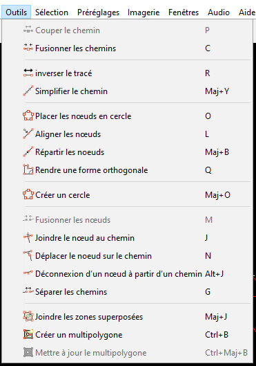
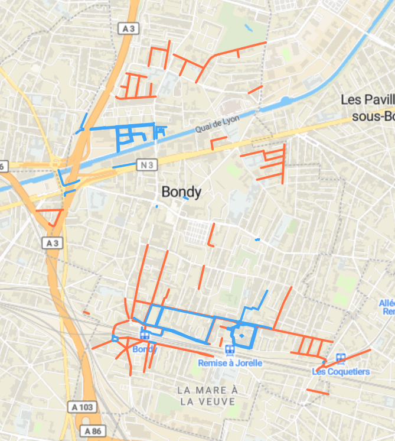
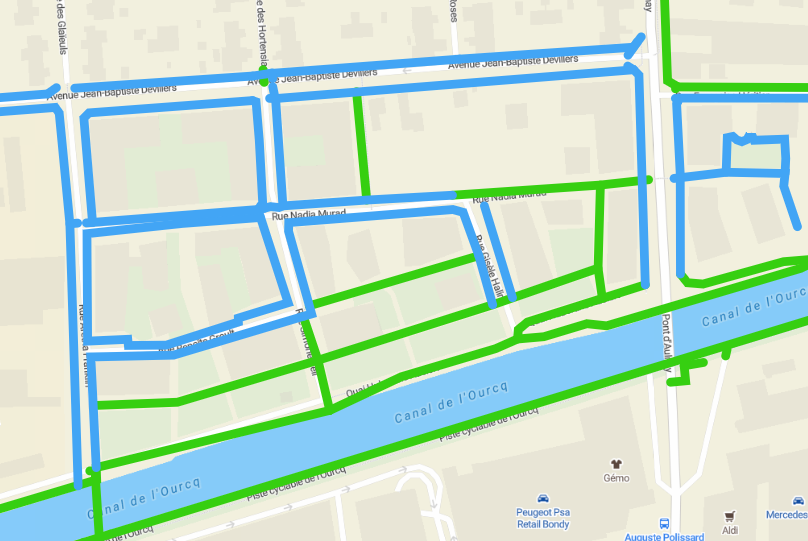
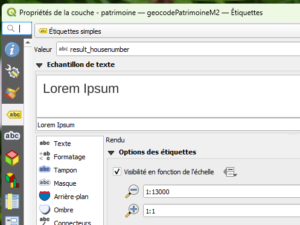
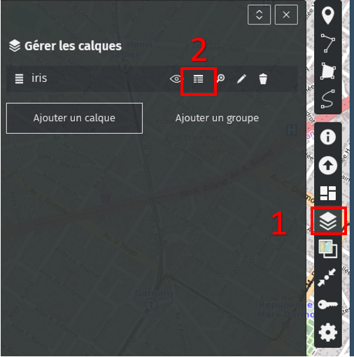
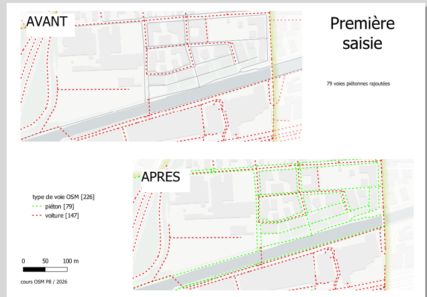

# Objectif

Aller au coeur de la nébuleuse OSM dés cette première journée, nous ferons une première saisie avec un éditeur simple et complexe à la fois, JOSM.

Deux cartes seront demandées :

-   Une carte d'ensemble établissant un diagnostic de la saisie autour de la marchabilité

-   Une carte avant / après la saisie pour chaque zone étudiée.

# 1e saisie pour comprendre

## Interface JOSM

[interface (panneaux)](https://manual.inasafe.org/_images/4_017.png)

Attention, clic droit pour se déplacer

## Primitives géométriques : noeud et chemin

Ouvrir une page vierge sous JOSM et créer un triangle avec 3 noeuds en utilisant les modes :

-   a pour ajout

-   s pour sélection

-   succession de a et s pour tracer plusieurs chemins

Faire le triangle, ajouter un point, le déformer.

::: callout-tip
Exercice : à partir du support *Éditer sous JOSM = attention aux nœuds*
:::

## Les raccourcis : le nerf de la guerre

Dans JOSM, les raccourcis permettent de travailler très très vite. Ils sont essentiels. Les raccourcis sont listés dans le menu *Outils*.



Pour une mise en situation une [vidéo du capitaine Moustache](https://www.youtube.com/watch?v=R4lHkhWHkkE)

Quels raccourcis vont servir le plus ?

## Valeurs attributaires dans OSM : Tag = clé + valeur

<https://taginfo.openstreetmap.org/>

### Editeur id ou le tag du bourgeois gentilhomme

On utilise directement l'éditeur intégré *id* sur openstreetmap.org trouver le tag directement à partir de l'éditeur.

::: callout-tip
exercice : faire une saisie sur un point connu
:::

### Quels tags ?

rues (en général) et croisements, découvrir taginfo.

::: callout-tip
exercice : Quelles sont les principales valeurs ? comment trouver les tags pour rues et croisements ?
:::

# Extraction OSM = overpass turbo

Il existe beaucoup d'outils, y compris intégrés dans Qgis. Mais ils sont tous basés sur le même outil : *overpass turbo*

## Premère approche

Utiliser l'assistant et extraire rues et croisements avec le caractère joker.

-   comment limiter l'extraction à Bondy ?

-   quel est ce caractère ?

-   attention au *et*

::: callout-tip
exercice : Combien de chemins et de noeuds pour cette requête ? pourquoi ?

```         
crossing=* or highway=* et crossing=* and highway=*
```
:::

::: callout-tip
exercice : Les iris ne sont pas dans OSM, mais les limites de la commune si (admin_level=8) : les enregistrer
:::

# CARTE 1 : Etat des lieux routes piétonnes sur l'ensemble de la ville

::: callout-caution
Avant de faire la carte, quizz !
:::

## L'objectif

Avant de commencer à saisir dans OSM, on fait une carte de l'état de la saisie sur le modèle obtenu dans l'appli [OSM marche](https://osmarche.someware.fr/).

 Pour la complexité des tags, regarder dans couche

Par exemple, chemins piétons et trottoirs dessinés



## Savoir-faire QGIS de base

-   mettre un favori dans l'explorateur sur les répertoires Téléchargement et data (vider le répertoire Téléchargement au passage)

-   intégrer une couche dans Qgis

-   fond positron avec le plugin QMS

-   utiliser une symbologie par catégorie

-   mise en page qgis (3 boutons)

::: callout-tip
S'aider de la procédure du support *Faire une 1e carte QGIS*
:::

## Savoir-faire QGIS plus complexes

-   organiser son projet

-   style en polygone inversé et remplissage dégradé suivant la forme pour les limites de la commune

-   règle de style : le style catégorisé doit être affiné

-   étiquettes de rue

-   facultatif = passages piétons (symbole par rapport à l'angle de la rue)

::: callout-tip
S'aider de la procédure du support *Organiser son projet QGIS*, *style en polygone inversé*, *règle de style : voies piétonnes et les autres*, *Etiquettes : petits trucs*, *orienter son passage piéton*
:::

A rajouter dans les petits trucs sur les étiquettes : l'échelle de visibilité



## Fait / pas fait ?

Reprendre le tableau oui / non et rajouter fait / pas fait

couleur en fonction

`r colorbox ("oui et fait", "green")` 
`r colorbox ("oui et non fait", "red")` 
`r colorbox ("non et fait", "orange")`
`r colorbox ("non et non fait", "green")`


```{r}
matrice <- read.csv("data/faitPasFait.csv")
knitr::kable(matrice)
```


# Première saisie


## Récupération de sa zone : une carte umap

```{r}
library(sf)
library(mapsf)
# lecture de la couche filtrée (issus de m3_prescription_surf)
iris <- st_read("data/iris.geojson")
# nb d'éléments
nbIris <- length(iris$nom_iris)
mf_map(iris, type = "typo", var = "nom_iris", leg_pos = NA, border = NA, pal = cm.colors(22))
mf_label(iris, "nom_iris", overlap = F, col = "cadetblue4")
mf_layout(paste0(nbIris, " iris sur Bondy"), credits = "data.gouv\nAoût 2026")
```

Chaque étudiant clique sur une carte umap [iris](https://umap.openstreetmap.fr/fr/map/iris_1446228#15/48.906973/2.487459) mise en place pour le cours.



puis calque (1) et tableau(2)

Attention à bien visualiser sa zone avant d'ouvrir le tableau !

## Ouvrir sa zone spécifique sous JOSM

exporter en JOSM ses Iris

::: callout-tip
voir procédure *porter sa zone dans JOSM et paramétrer sa vue pour saisir*
:::

## 1e saisie

On prépare la carte avant / après donc il faut sauvegarder les données mais pour sa zone uniquement

### Carte avant

Une fois les zones partagés, sous Qgis, chaque étudiant fait une *intersection* sur sa zone, menu vecteur / géotraitement / intersection.

### Utilisation du [plugin sidewalk](https://community.openstreetmap.org/t/josm-sidewalk-plugin-tutorial/134088)

::: callout-tip
voir procédure *Saisie JOSM avec le plugin Sidewalk*
:::


# CARTE 2 : résultat de la saisie

Compléments pour la carte avant / après

Avec un commentaire décrivant la donnée de type "J'ai tant de chemins piétons et tant de croisements etc..."


::: callout-tip
compétences Qgis pour le avant / après : utilisation des thèmes voir support *carte 2*
:::




Au vu du résultat, quelles autres compétences ?
