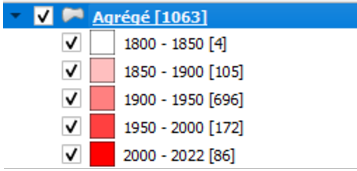

# Objectif

Pour faire un peu d'OSM sur cette première journée, nous ferons une première saisie.

Mais l'objectif principal de la séquence est d'explorer les données proposées en les cartographiant.

Une carte présentant les données à analyser sera donc demandée à la fin de cette journée.

Les données étant plus nombreuses que les étudiants, chaque étudiant prendra en charge plusieurs adresses.

# 1e saisie pour comprendre

## Interface JOSM

[interface (panneaux)](https://manual.inasafe.org/_images/4_017.png)

Attention, clic droit pour se déplacer

## Primitives géométriques : noeud et chemin

Ouvrir une page vierge sous JOSM et créer un triangle avec 3 noeuds en utilisant les modes :

-   a pour ajout
-   s pour sélection
-   w pour write

Faire le triangle, ajouter un point, le déformer.

::: callout-tip
Exercice : à partir du support
:::

## Tag = clé + valeur

<https://taginfo.openstreetmap.org/>

on utilise directement l'éditeur intégré *id* sur osm.org trouver le tag directement à partir de l'éditeur.

exercice : faire une saisie sur un point connu

## Outils de qualité

[utilisation du changeset](https://resultmaps.neis-one.org/osm-changesets?comment=paris8#4/32.58/-6.77)

[carte des utilisateurs](https://resultmaps.neis-one.org/oooc?zoom=15&lat=48.90494&lon=2.493&layers=BTFFFFFT&contributors=TTTTFF)

également dans [osmose](http://osmose.openstreetmap.fr/fr/map/#zoom=16&lat=48.90695&lon=2.49237)

Mais le mieux reste :

[historique dans openstreetmap.org](https://www.openstreetmap.org/history#map=18/48.916214/2.486000)

# Extractions diverses OSM

## Quels tags ?

rues et bâtiments, aller dans taginfo. Quelles sont les principales valeurs ?

## Overpass pour extraire

Il existe beaucoup d'outils, y compris intégrés dans Qgis.

Utiliser l'assistant et extraire rues et bâtiments avec le caractère joker.

-   comment limiter l'extraction à Bondy

-   quel est ce caractère ?

-   attention au *et*

## Autres extractions

-   les limites de la commune (admin_level=8) : les enregistrer dans le gpkg patrimoine.gpkg.

# CARTE 1 : les bâtiments et les zones du patrimoine d'après les données PLUi M3

::: callout-caution
Avant de faire la carte, quizz !
:::

## Savoir-faire QGIS

-   mettre un favori dans l'explorateur sur les répertoires Téléchargement et data (vider le répertoire Téléchargement au passage)

-   intégrer une couche dans Qgis

-   utiliser un ensemble de règles pour le style

-   fond positron avec le plugin QMS

-   mise en page qgis (3 boutons)

-   style en polygone inversé et remplissage dégradé suivant la forme pour les limites de la commune

## Autres données : la commune

-   Tag = admin_level=8 in Bondy dans overpass-turbo

-   couche du cadastre

## Mise en page

classique : titre / échelle / crédits

::: callout-tip
S'aider de la procédure du support *Faire une 1e carte QGIS*
:::

# Utiliser une deuxième source

## Pourquoi une deuxième source ?

### Un nombre d'éléments différent

Voir [tableau des sources](01_intro.html#pr%C3%A9sentation-du-plui-et-tableau-r%C3%A9capitulatif-des-sources-pour-le-cours), différence en nombre d'éléments.

```{r}
library(sf)
# lecture de la couche filtrée (issus de m3_prescription_surf)
carte <- st_read("data/patrimoine.gpkg", "patrimoineFiltre2154")
# nb d'éléments
elementsCarte <- length(carte$LIBELLE)
# lecture de la couche issue du tableau de la M3
geocodage <- st_read("data/patrimoine.gpkg", "geocodageM3")
# nb d'éléments
elementsGeocodage <- length(geocodage$typo)
# différence
elementsCarte - elementsGeocodage
```

### Une typologie complémentaire

De plus, éléments complémentaires dans le .pdf

-   une nouvelle typologie

```{r}
table(geocodage$typo)
# plus riche que
table(carte$LIBELLE)
```

## Superposition des deux informations sur une seule carte

Résultat à obtenir : utiliser un symbole svg pour les points et un remplissage pour les polygones.


::: callout-tip
S'aider de la procédure du support *Organiser son projet QGIS* et *Etiquettes : deux petits trucs*
:::

A rajouter dans les petits trucs sur les étiquettes : l'échelle de visibilité


## Quels problèmes possibles ?

```{r}
matrice <- read.csv("data/avantageInconvenient.csv")
knitr::kable(matrice)
```

La solution : intégrer point et polygone dans le polygone du bâtiment dans OSM.

# Une troisième source

Une donnée essentielle pour le patrimoine est la date de construction du bâtiment. cette information est présente dans le cadastre.

```{r}
cadastreAn <- read.csv("data_raw/cadastreAnParcelle.csv")
# 50 M
cadastre <- st_read("data/patrimoine.gpkg", "cadastre")
# 8 000
jointure <- merge(cadastre, cadastreAn, by.x = "geo_parcelle", by.y = "parcelle" )
# 50 M
st_write(jointure, "data/patrimoine.gpkg", "cadastreAn", delete_layer = T)
length(unique(jointure$geo_parcelle))
# 5803 il y a des parcelles qui ont plusieurs dates, pourquoi ?
```

La jointure est faite, reste l'intersection pour récupérer les données de la parcelle dans le bâtiment.

::: callout-tip
Voir le support, procédure *Géotraitements QGIS : de la parcelle au bâtiment*
:::

# Vérification des données

A vue d'oeil, point géocodé et polygone correspondent, mais, pour traiter finement la donnée, on va se la répartir.

## Répartir le travail

C'est l'occasion de faire de la géomatique avancée. Malheureusement, ce n'est pas l'objet du cours, donc, on passe vite sur le sujet.

::: callout-tip
Le support présente les deux méthodes dans la procédure *Répartir le travail : quelle méthode utiliser ?*
:::

A noter, l'utilisation d'un script python trouvé sur internet : [constrainted_kmeans.py](https://spatialthoughts.com/2021/01/31/equal-sized-kmeans-qgis/)

## Quelles vérifications ? (CARTE 2)

C'est l'étape dans laquelle, chaque étudiant ayant une petite zone, le collaboratif prend tout son sens. Encore faut-il définir la méthode...

Une fois les zones partagés, chaque étudiant fait une *intersection* sur sa zone, menu vecteur / géotraitement / intersection.

### Etude de cas particuliers

#### Lister les anomalies

Il vérifie que :

-   pour chaque bâtiment, il existe un point.

-   la typologie est cohérente : à quoi correspondent les bâtiments de niveau 3 en typologie ?

Toutes les anomalies sont notées dans le framacalc dans les 2 colonnes prévues (correspondance bat-pt et cohérence typologie)

#### Cartographie et base adresse (CARTE 2)

Pour l'une des anomalies, l'étudiant en documente une sur une carte (CARTE 2) et rectifie au moins un géocodage sur la [base adresse](https://adresse.data.gouv.fr/decouvrir-la-BAN).

### Exemples

::: callout-tip
Le support, procédures *Relation entre liste géocodage et plan opposable* et *Vérifier le géocodage* donne une idée de ce qui est attendu
:::

## Vue d'ensemble par secteur : carte analysant la donnée sur le secteur (CARTE 3)

Faire une carte zoomée sur sa zone (CARTE 3), mettant en valeur

-   les années par bâtiment (style gradué)



-   les points adresses

Avec un commentaire décrivant la donnée de type "J'ai tant de bâtiments dont des gros de type / des petits, avec tant d'anomalies etc..."
