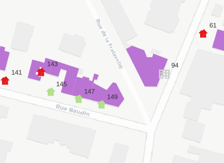
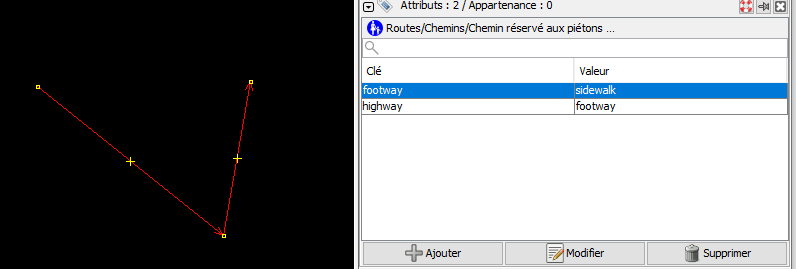
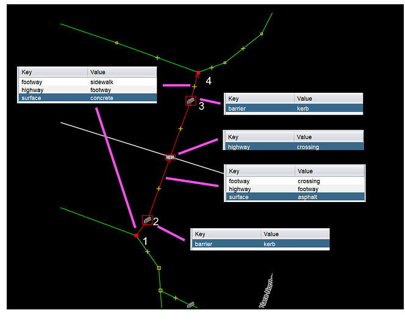

# Objectif

Aller au coeur de la nébuleuse OSM dés cette première journée, nous ferons une première saisie avec un éditeur simple et complexe à la fois, JOSM.

Deux cartes seront demandées :

-   Une carte d'ensemble établissant un diagnostic de la saisie autour de la marchabilité

-   Une carte avant / après la saisie pour chaque zone étudiée.

# 1e saisie pour comprendre

## Interface JOSM

[interface (panneaux)](https://manual.inasafe.org/_images/4_017.png)

Attention, clic droit pour se déplacer

## Primitives géométriques : noeud et chemin

Ouvrir une page vierge sous JOSM et créer un triangle avec 3 noeuds en utilisant les modes :

-   a pour ajout

-   s pour sélection

-   succession de a et s pour tracer plusieurs chemins

Faire le triangle, ajouter un point, le déformer.

::: callout-tip
Exercice : à partir du support *Éditer sous JOSM = attention aux nœuds*
:::

## Les raccourcis : le nerf de la guerre

Dans JOSM, les raccourcis permettent de travailler très très vite. Ils sont essentiels. Les raccourcis sont listés dans le menu *Outils*.


Pour une mise en situation une [vidéo du capitaine Moustache](https://www.youtube.com/watch?v=R4lHkhWHkkE)

Quels raccourcis vont servir le plus ?

## Tag = clé + valeur

<https://taginfo.openstreetmap.org/>

on utilise directement l'éditeur intégré *id* sur openstreetmap.org trouver le tag directement à partir de l'éditeur.

exercice : faire une saisie sur un point connu

## Outils de qualité

[utilisation du changeset](https://resultmaps.neis-one.org/osm-changesets?comment=paris8#4/32.58/-6.77)

[carte des utilisateurs](https://resultmaps.neis-one.org/oooc?zoom=15&lat=48.90494&lon=2.493&layers=BTFFFFFT&contributors=TTTTFF)

également dans [osmose](http://osmose.openstreetmap.fr/fr/map/#zoom=16&lat=48.90695&lon=2.49237)

Mais le mieux reste :

[historique dans openstreetmap.org](https://www.openstreetmap.org/history#map=18/48.916214/2.486000)

# Extractions diverses OSM

## Quels tags ?

rues (en général) et croisements, aller dans taginfo. Quelles sont les principales valeurs ? comment trouver les tags ?

## Overpass pour extraire

Il existe beaucoup d'outils, y compris intégrés dans Qgis.

Utiliser l'assistant et extraire rues et bâtiments avec le caractère joker.

-   comment limiter l'extraction à Bondy

-   quel est ce caractère ?

-   attention au *et*


exercice : combien de chemins et de noeuds pour cette requête ? pourquoi ?

```
crossing=* or highway=* et crossing=* and highway=*
```


## Autres extractions

-   les iris ne sont pas dans OSM, mais les limites de la commune si (admin_level=8) : les enregistrer

# CARTE 1 : Etat des lieux routes piétonnes sur l'ensemble de la ville

::: callout-caution
Avant de faire la carte, quizz !
:::

## Savoir-faire QGIS

-   mettre un favori dans l'explorateur sur les répertoires Téléchargement et data (vider le répertoire Téléchargement au passage)

-   intégrer une couche dans Qgis

-   utiliser un ensemble de règles pour le style

-   fond positron avec le plugin QMS

-   mise en page qgis (3 boutons)

-   style en polygone inversé et remplissage dégradé suivant la forme pour les limites de la commune

## Mise en page

classique : titre / échelle / crédits

::: callout-tip
S'aider de la procédure du support *Faire une 1e carte QGIS*
:::

## Superposition des deux informations sur une seule carte

Résultat à obtenir :

-   deux couleurs différentes pour les routes (piéton / voiture)

-   étiquettes de rue

-   facultatif = passages piétons (symbole par rapport à l'angle de la rue)



::: callout-tip
S'aider de la procédure du support *Organiser son projet QGIS*, *Etiquettes : deux petits trucs*, *orienter son passage piéton*
:::

A rajouter dans les petits trucs sur les étiquettes : l'échelle de visibilité


## Quels difficultés rencontrées ?

```{r}
matrice <- read.csv("data/avantageInconvenient.csv")
knitr::kable(matrice)
```

# Récupération de sa zone

```{r}
library(sf)
library(mapsf)
# lecture de la couche filtrée (issus de m3_prescription_surf)
iris <- st_read("data/iris.geojson")
# nb d'éléments
nbIris <- length(iris$nom_iris)
mf_map(iris, type = "typo", var = "nom_iris", leg_pos = NA, border = NA, pal = cm.colors(22))
mf_label(iris, "nom_iris", overlap = F, col = "cadetblue4")
mf_layout(paste0(nbIris, " iris sur Bondy"), credits = "data.gouv\nAoût 2026")
```

Chaque étudiant clique sur une carte umap [iris](https://umap.openstreetmap.fr/fr/map/iris_1446228#15/48.906973/2.487459) mise en place pour le cours.


puis calque (1) et tableau(2)

Attention à bien visualiser sa zone avec d'ouvrir le tableau !

# 1e saisie

On prépare la carte avant / après donc il faut sauvegarder les données mais pour sa zone uniquement

## Carte avant

Une fois les zones partagés, sous Qgis, chaque étudiant fait une *intersection* sur sa zone, menu vecteur / géotraitement / intersection.

## Utilisation du [plugin sidewalk](https://community.openstreetmap.org/t/josm-sidewalk-plugin-tutorial/134088)

### Paramétrage

installation du plugin (F12 puis *greffon*)

installation du raccourci MAJ + s

### Utilisation

#### La base

MAJ + s = observer le pointeur 

on trace, puis s pour sortir du mode ajout et passer en mode sélection

aa pour sortir du mode sidewalk (regarder le pointeur)



Que fait le plugin ?

#### Les croisements



# CARTE 2 : Compléments pour la carte avant / après

Avec un commentaire décrivant la donnée de type "J'ai tant de chemins piétons et tant de croisements etc..."

utilisation des thèmes
