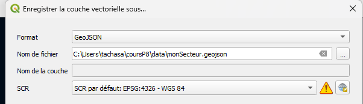
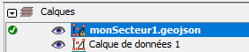
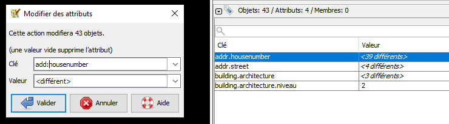
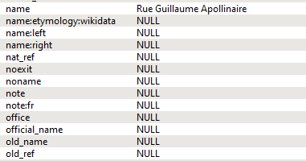
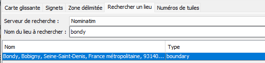
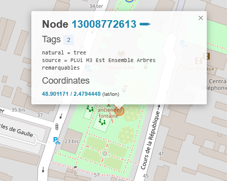
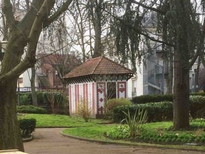
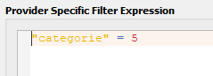
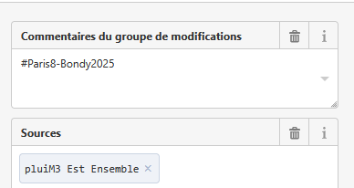

# Objectif

Une fois analysée la donnée, il s'agit de la saisir dans OSM.

# Lister les données

# Recherche des tags pour la donnée

## Méthode

outils vus au début : features et taginfo

Les étudiants travaillent en 3 groupes :

-   l'un sur features,

-   l'autre sur taginfo,

-   et le 3e uniquement sur l'IA.

## Résultats : tags choisis

-   année de construction / nb de construction =

    -   start_date

    -   construction_date:nb

-   pour l'adresse = addr:housenumber / addr:street

-   pour la typologie =

    -   building:architecture= (immeuble/maison de bourg/pavillon)

    -   building:architecture:niveau(emblématique/remarquable/représentatif)

-   pour tous les bâtiments = historic:building=yes

-   Pour l'enveloppe

    -   boundary=patrimoine

    -   name= (par exemple, quartier Michelet)

# Validation des tags choisis en faisant des requêtes overpass

Sur plusieurs échelles : Bondy et l'Ile de France par exemple

voir [ici](02_jour1.html#quels-tags)

# Préparer sa donnée sous QGIS pour l'import dans JOSM

## Consigne

3 couches en 4326 et geojson

-   celle des batiments avec la typo + année min (= mesBat4326 par exemple)

-   Le pt adresse avec adresse et typo2 (= mesAdresses4326)

-   l'enveloppe convexe attribuée (= maZone4326)

Pour chacune des 3 couches mettre uniquement les tags choisis par les étudiants



::: callout-tip
Le support présente les deux méthodes dans la procédure *Préparer ses couches sous QGIS* et encore une fois *Simplifier ses couches*
:::



## Fichiers à disposition

Les fichiers pour les étudiants demandeurs

### Secteurs à préparer

```{r}
demande <- read.csv("data/importJOSM.csv")
table(demande$couches.à.importer.dans.JOSM..ok..help.)
demande <- demande [demande$couches.à.importer.dans.JOSM..ok..help. != 'ok',]
zone <- demande$nom.zone
```

### Récupération des données

```{r}
library(sf)
enveloppe <- st_read("data/enveloppeParEtudiant.geojson")
adresse <- st_read("data/patrimoine.gpkg", "geocodageM3")
bat <- st_read("data/agregationCadastrePatrimoine.geojson")
# conversion en 4326
bat <- st_transform(bat, 4326)
```

### Travail sur les couches

#### Couche enveloppe

```{r}
# renommage tags
names(enveloppe)
enveloppe$boundary <- "patrimoine"
enveloppe$name <- enveloppe$CLUSTER_ID
library(mapsf)
mf_map(enveloppe)
mf_label(enveloppe, var = "name")
mf_layout("Attributions des enveloppes", "cours 2025 OSM")
# filtrage tags
enveloppe <- enveloppe [, c("name", "boundary")]
plot(enveloppe)
```

#### Couche adresse

```{r}
names(adresse)
adresse$'building:architecture' <- adresse$typo
adresse$'building:architecture:niveau'<- adresse$niveau
adresse$'addr:housenumber' <- adresse$result_housenumber
adresse$'addr:street' <- adresse$result_street
adresse <- adresse [, c("building:architecture", "building:architecture:niveau", "addr:housenumber", "addr:street")]
plot(adresse)
```

#### Couche bâtiment

```{r}
names(bat)
names(bat)[1] <- "construction_date:nb"
names(bat)[3] <- "start_date"
bat$'historic:building' <- "yes"
bat <- bat [, c("start_date", "construction_date:nb", "historic:building")]
plot(bat)
```

### Intersection par enveloppe et enregistrement des couches

Vérification de la validité des géométries

```{r}
table(st_is_valid(bat))
bat <- bat [st_is_valid(bat),]
```

```{r}
zone <- c(1, zone)
for (z in zone){
  print(z)
  sel <- enveloppe [enveloppe$name == z,]
  st_write(sel, paste0("data/demande/",z,"_zone.geojson"), append=F)
  interBat <- st_intersection(bat, sel)
  interBat
  interBat <- interBat [,  c("start_date", "construction_date.nb", "historic.building")]
  st_write(interBat, paste0("data/demande/",z,"_bat.geojson") , append = F)
  interAdresse <- st_intersection(adresse, sel)
  interAdresse <- interAdresse [, c("building.architecture", "building.architecture.niveau", "addr.housenumber", "addr.street")]
  st_write(interAdresse, paste0("data/demande/",z,"_adresse.geojson") , append = F)
}
```

### Correction de la donnée sous JOSM

Attention, les ":" sont remplacés par des ".", il faut corriger sous JOSM avec un rechercher (CTRL + F)



# JOSM : rappel et mise au point

voir [ici](02_jour1.html#interface-josm)

## Attributs

Comment appelle-t-on les attributs dans OSM ?

### Une multiplication d'attributs

exemple pour les rues



### Des erreurs nombreuses

Il n'y a rien de plus difficile que de recopier un texte. *building* peut devenir *Building* par exemple.

Observer les attributs, repérer les erreurs d'attributs avec [osmose](http://osmose.openstreetmap.fr/fr/map/#zoom=16&lat=48.90695&lon=2.49237)

## Géométries

Quels sont les deux primitives géométriques vues le premier jour ?

A priori, pas de travail sur la géométrie, mais il peut y avoir des opérations à mener sur la géométrie des bâtiments.

Pas de panique, la communauté OSM a produit une [osmecum](https://wiki.openstreetmap.org/wiki/France/Osmecum) sur les bâtiments.

# Saisie dans JOSM

## Import d'une zone spécifique

Les deux boutons


Essayer de télécharger :

-   l'ensemble de la ville à partir de l'onglet nominatim,



-   sa zone via une carte glissante,

-   et enfin à partir du raccourci décrit dans la procédure *Importer sa zone*

## Pourquoi ne pas importer en masse ?

### C'est possible

Le [tableau](https://wiki.openstreetmap.org/wiki/Import/Catalogue) des imports en masse dans OSM

et notamment sur les arbres isolés de St Etienne :

L'exemple d'un [projet git](https://github.com/defuneste/arbresosm) sur l'import des arbres dans OSM

### Mais ce n'est pas conseillé

voir sur [forum des utilisateurs OSM en France](https://forum.openstreetmap.fr/t/geomas-import-de-donnees-en-masse-dans-osm/6469/4)

Ponctuellement, on peut essayer, faire la requête overpass sur *natural=tree in bondy*

Trouver l'erreur dans le square Mitterrand.





Donc il vaut mieux faire un import au cas par cas, surtout que, pour les bâtiments patrimoniaux, le bâtiment existe déjà.

## Facilitateurs

Ces outils qui permettent une saisie plus facile

### Filtre

### Outil de filtre

[le wiki](https://josm.openstreetmap.de/wiki/Fr%3AHelp/Dialog/Filter)

Détailler le fonctionnement, voir [alterzorg](https://www.alterzorg.fr/josm/filtre)



Il s'agit de travailler uniquement sur les bâtiments.

### Colorisation de la donnée

::: callout-tip
Dans la procédure *Importer sa zone*, voir le point *3. Colorier sa zone*
:::

Que dire d'une extension *.mapcss* ?\*

## Méthode proposée

::: callout-tip
Voir procédure *Saisie JOSM*
:::

Attention au commentaire du changeset ! (#Paris8_Bondy2025)



Dans le framacalc, les étudiants mettent le nombre de saisies effectuées et les difficultés rencontrées

Afin de vérifier la saisie, quel tag proposer dans Overpass turbo ?

::: callout-tip
Voir procédure *Utiliser overpass turbo*
:::
