# Objectif

Utiliser un plugin QGIS pour saisir le graphe piéton et importer le résultat dans OSM.

# Rappel des tags à utiliser

Observer le réseau routier dee la ville

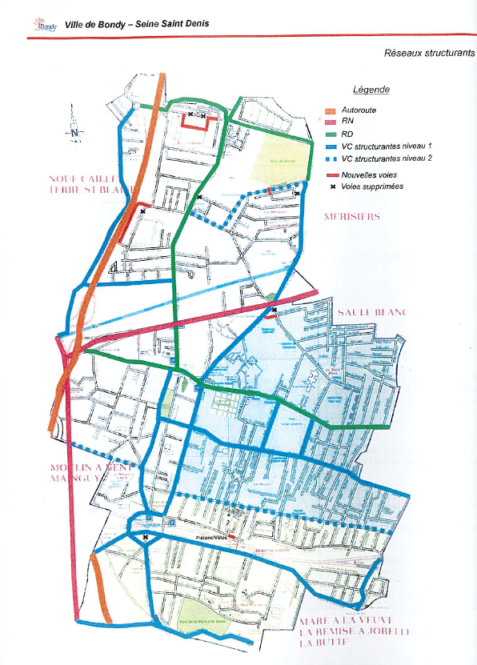

Observer, pour son secteur, si la voirie OSM respecte bien le plan de circulation de 2006 proposé par un cabinet d'étude.

Rectifier le cas échéant dans JOSM.

# Présentation du plugin QGIS

[SOTM mondial 2022](https://www.youtube.com/watch?v=B--1ge42UHY)

Installer le plugin dans Qgis

[le tutoriel](https://www.youtube.com/watch?v=jq-K3Ixx0IM)

importance du paramétrage : 5 étapes en rouge

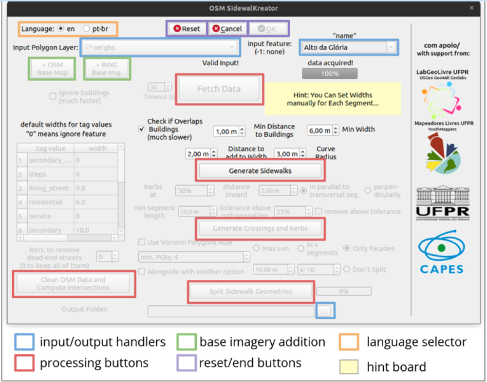

# Une règle à respecter

Dés le départ, on peut effacer mais ce n'est pas une pratique de type collaborative que d'effacer le travail d'autrui !

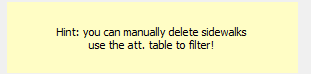

Ici 4 valeurs sur 66.

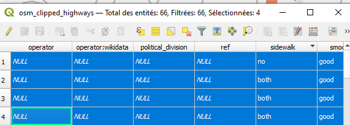

Il vaut mieux examiner le cas particulier.

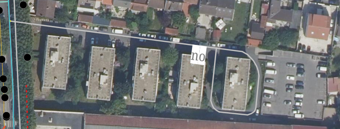

# Quelques tests

## Carte 3 : Un test sur un zone et son buffer

Lister les sf Qgis permettant d'aller rapidement

donner 5 mn pour faire la carte

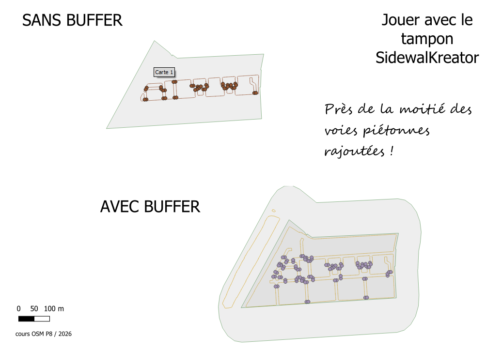

## Quels paramètres ?

### Largeur des rues

#### Hiérachie OSM

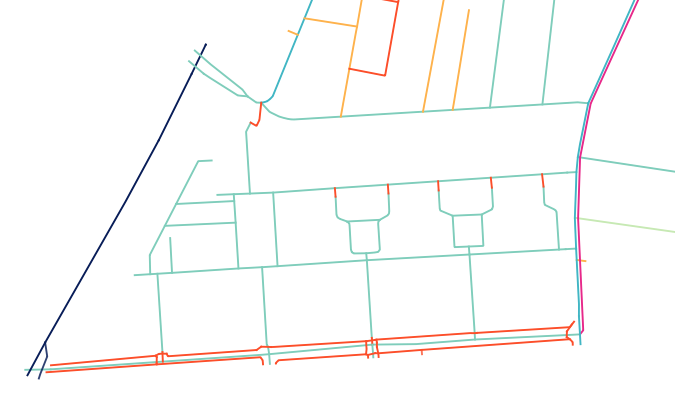

dans taginfo, repérer les valeurs et leur signification.

faire une proposition de modification

#### Choix largeurs

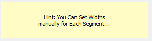

Par défaut :

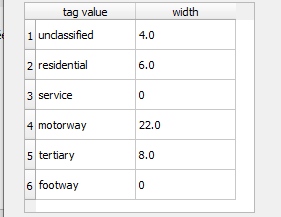

Quelles modification possibles ici ?

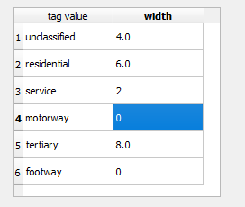

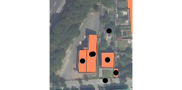

Rajouter cette voie change la perspective du plugin. Si on la rajoute en service, il faudra alors modifier la largeur dans le plugin.

#### Indicateurs : aire et périmètre

Ce rapport aire / périmètre permet de repérer des zones problématiques :

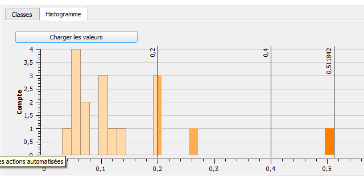 Dans la plupart des cas, l'aire de la zone trottoir et le périmètre tourne autour de 0,1. Cela signifie que pour 1 m² de trottoir, il y a 10 cm de longueur.

Quand ce rapport augmente, on se retrouve avec trop de m². Cela permet de repérer les îlots et les rond points (normalement pas de franchissement piéton).

Dans notre cas, il y a 3 zones problématiques.

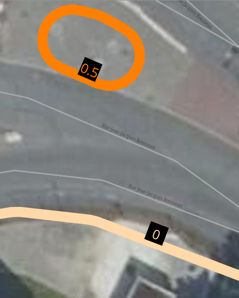

Ici il s'agit d'un ilôt et le cheminement piéton sera de toutes façons *uncontrolled* parce que non prévu ! Il faudrait prévoir un aménagement.

En fait, il convient vraiment de se poser la question des aménagements piétons sur la zone :

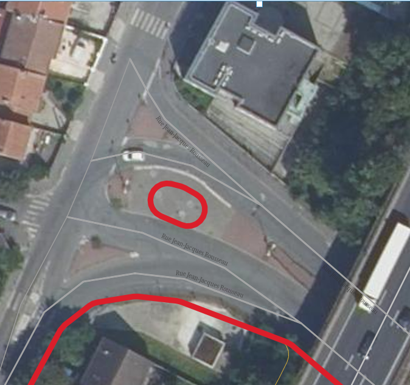

Nous verrons la deuxième zone plus bas.

CARTE 4 : intégrer un histogramme dans une mise en page Qgis

### Bâtimens ou pas ?

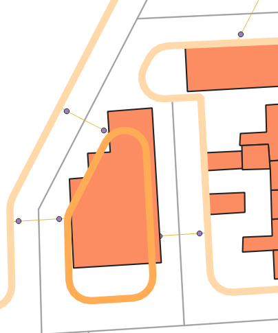

A noter que cette zone était déjà repérable grâce au ratio aire / périmètre

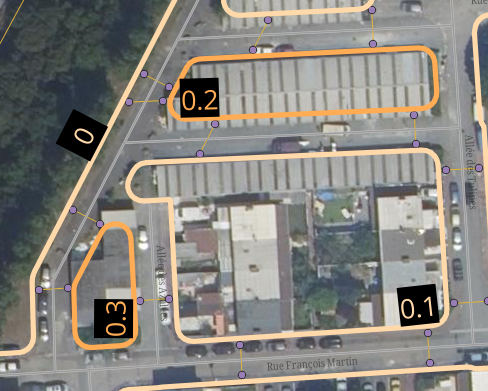

Il manque une voie de service, on la rajoute puis on relance avec les paramètres par défaut et une voie de service avec une largeur de 2.

#### Supprimer de bâtiments

#### Jouer sur distance bâtiments - voie

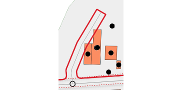

Pour obtenir, un non chevauchement sur les bâtiments on met au minimum :

-   la distance aux bâtimetns et la largeur

-   la distance à ajouter à la largeur

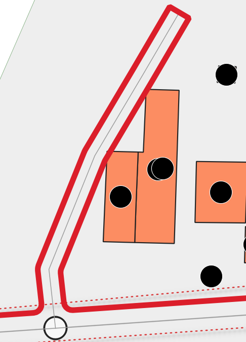

CARTE 5 : carte avant après avoir joué sur les paramètres

### Zones d'exclusion ou zones sûres

Il s'agit de prévoir l'intégration dans OSM.

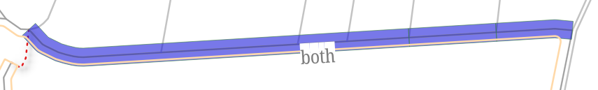

Ici, comme la rue est taggée sidewalk=both, le plugin ne rajoute pas de voie piétonne. pour le Plugin, c'est une zone *sûre*. A l'utilisateur de supprimer le tag dans OSM et de rejouer le plugin pour permettre que le trottoir soit retracé *correctement*.

Il existe égalemetn les zones d'exclusions : si dans la surface, il y a plus de 50 % de footway existante, le plugin ne propose aucun trottoir. Le travail a déjà été fait, le plugin ne propose aucune modification.
