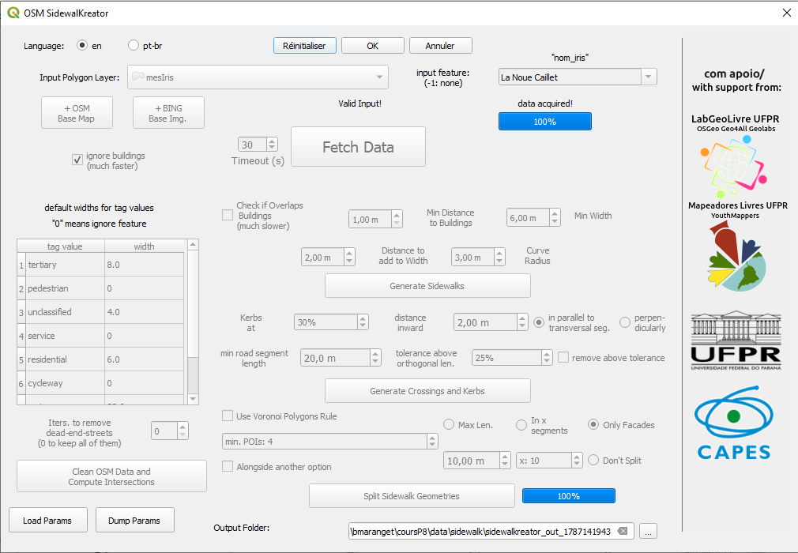

# Objectif

Utiliser un plugin QGIS pour saisir le graphe piéton et importer le résultat dans OSM.

# Présentation du plugin QGIS

[SOTM mondial 2022](https://www.youtube.com/watch?v=B--1ge42UHY)

Installer le plugin dans Qgis

[le tutoriel](https://www.youtube.com/watch?v=jq-K3Ixx0IM)

importance du paramétrage

