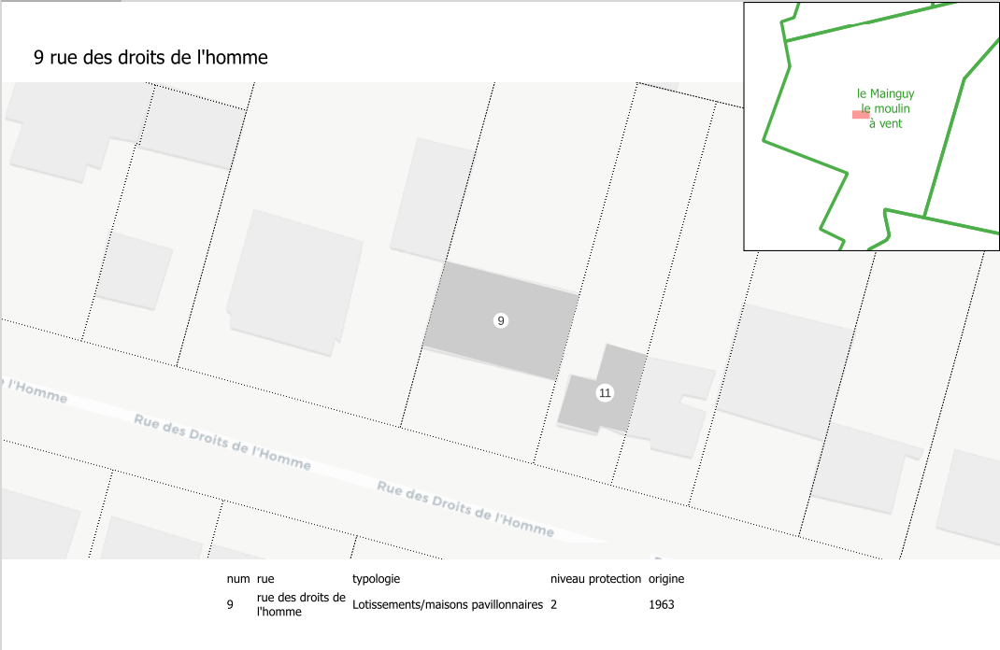
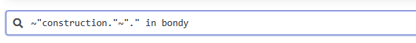
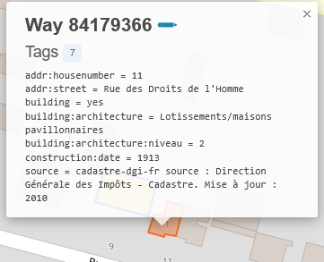
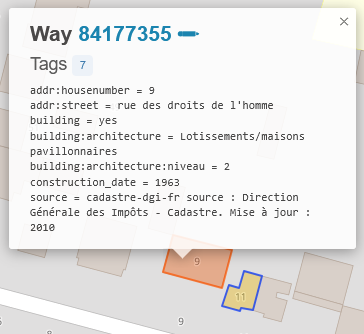
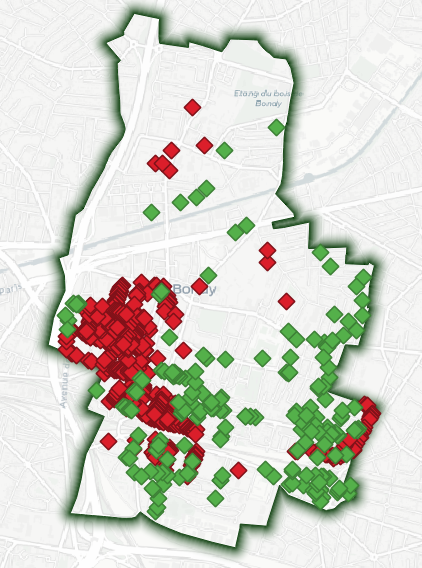
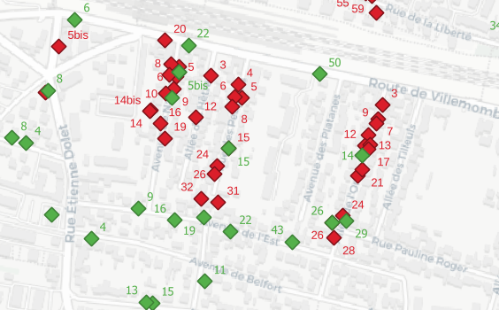
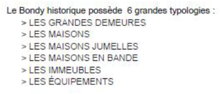
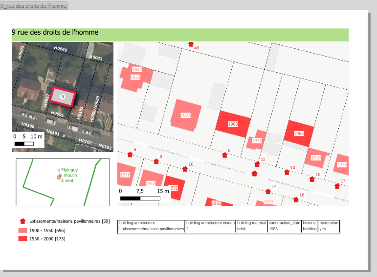

# Objectif

La première saisie va permettre la création d'un atlas simple sous QGIS à partir de l'export d'overpass turbo, qui permettra de faire une 2e saisie et un atlas plus complexe.

# Atlas

::: callout-tip
Voir la dernière procédure *Faire un atlas sous QGIS*
:::



Savoir-faire QGIS

-   atlas (avec expression pour le nom de la page)

-   table attributaire (avec filtre sur l'item de l'atlas)

-   aperçu

-   thèmes

# Bilan de la saisie

Quelle est la différence entre le nombre de contributions saisies et le nombre de contribution réelle ?

## Nb de contributions saisies

```{r}
nb <- read.csv("data/nbSaisie.csv")
saisie1 <- sum(nb$nb.de.batiments.traités,na.rm=T)
saisie2 <- sum(nb$nb.bat.traités.2e.saisie, na.rm=T)
saisie3 <- sum(nb$X2e.saisie..avec..tags.complémentaires., na.rm=T)
total <- t(data.frame(saisie1, saisie2, saisie3))
barplot(total [,1], names.arg = rownames(total), col = "antiquewhite", border = NA, main = paste0(sum(total), " contributions annoncées"))
```

## Nb de contributions réelles

[neis, carte des changesets](https://resultmaps.neis-one.org/osm-changesets?comment=Paris8#6/46.995/2.318)

Number of Map Changes: 677 !

Dans Overpass Turbo, on fait une recherche en utilisant le AND et le OR

```
start_date=* AND building:architecture=*  
start_date=* OR building:architecture=*  
```

188 polygones et 472 polygones


Les problèmes sont listés avant la 2e session de saisie.

exemple de problème type

  

# Deux dernières sources

## Présentation

Elles donnent d'autres éléments pour la description mais leur reprise est plus problématique.

#### Citaviz

Voir [ici](01_intro.html#un-outil-collaboratif-de-carto-web)

```{r}
library(sf)
citaviz <- st_read("data/patrimoine.gpkg", "geocodecitaviz")
head(substring(citaviz$detail,1,20))
```

#### Les fiches

voir [ici](01_intro.html#des-fiches-scannés-et-re-scannés)

Lister les propositions des étudiants

## Analyse de la donnée

### La carte

{width="300px"} {width="300px"}

## Que dit la carte ?

```{mermaid}
flowchart LR
  A[fiches de 2011]  --> C{M3 de 2025}
  B[collaboratif 2024] --> C
```

## Evaluation chiffrée

```{r}
citaviz2024 <- st_read("data/patrimoine.gpkg", "geocodecitaviz")
fiche2011 <- st_read("data/patrimoine.gpkg", "geocodePatrimoineM2")
sum(length(fiche2011$texte), length(citaviz2024$ID))
```

A rapprocher des 719 éléments de cartographie M3.

## Contenu

### Citaviz

Des bâtiments sans numéro

```{r}
pbNumMaison <- citaviz [is.na(citaviz$result_housenumber), ]
knitr::kable(pbNumMaison [, c("adresse", "result_name"), drop = T])
```

### Les fiches

Comment récupérer les données des [fiches](01_intro.html#des-fiches-scannés-et-re-scannés), et notamment les photos ?

### Nouveaux éléments

Observer un nouvel élément de patrimoine

```{r}
table(citaviz$Couche)
```

Il y a également une nouvelle typologie (cf le cahier des recommandations architecturales dans *7.4.19 Annexe anciennes fiches communes.pdf*, p. 943)



# Nouvelle saisie

Cette fois ci, on travaille directement sur le calque de données, on cherche la fiche avec l'index et on tague tous les éléments possibles à l'adresse. On travaille par rue puisque les fiches sont par rue.

```{r}
index <- read.csv("data_raw/indexPatrimoineCorrige.csv")
head(index)
tab <- table(index$livret)
fin <- NULL
for (i in c(1:3)){
  tmp <- seq (1, tab [i])
  fin <- c(fin, tmp)
}
index$numFiche <- fin
write.csv(index,"data_raw/indexPatrimoineNumPage.csv")
```

En bilan, toujours le nombre de bâtiments et les problèmes rencontrés dans des fiches spécifiques particulièrement fournies.

# Vérification

Requête overpass sur le(s) nouveau(x) tag(s) et comparaison avec l'annoncé.

Pour la qualité, on recherche avec les expressions régulières

# Atlas complexe (CARTE 5)

On cherche à se rapprocher le plus possible du modèle de fiche.



Compétence QGIS

Mettre en surbrillance l'élément de l'atlas : utiliser les variables d'atlas pour la mise en forme (cf [cours QGIS ministère transition écologique](https://www.camillechevrier.fr/formations/01_qgis_prise_en_main/M06_MiseEnPage_web_gen_web/co/45_N1_Atlas.html))

Mais l'essentiel reste dans le tableau attributaire tous les éléments saisis dans OSM.


::: callout-caution
évaluation de satisfaction !
:::
