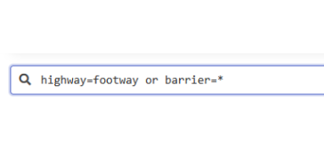
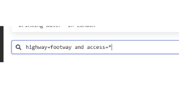

# Objectif

Afin de voir ce qui manque dans notre graphie, on utilise la fonction itinéraire de Qgis

Dans le projet Qgis, on en est à l'étape *saisie 3*

# Un premier round d'observation

Il convient de revenir sur ce que le plugin a permis de faire en faisant une requête overpass

ou

## Dessiner les jardins

Pour le raccourci voir la procédure 1 (voir également l'outil dessiner à l'échelle)

## Changer des tags

## Compléter le tag crossing

## 2 manières de figurer un passage piéton

## 2 manières de représenter une porte empêchant le passage

# Utilisation de l'outil plus court chemin dans QGIS

Après avoir fait une premier itinéraire, on modifie notamment les barrier=gate et on regarde si cela génère autre chose

Encore une carte avant et après :

Quelle est la manière de faire ?

Autre outil à utiliser : grass hooper

Voir dans le forum, la discussion https://forum.openstreetmap.fr/t/comprendre-la-cle-access-et-ses-valeurs-private-surtout/10804

# En guise de conclusion, ce qu'il reste à faire

2 novueaux outils

## Panoramax

## Street Complete

# 

