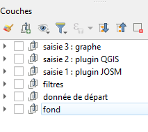
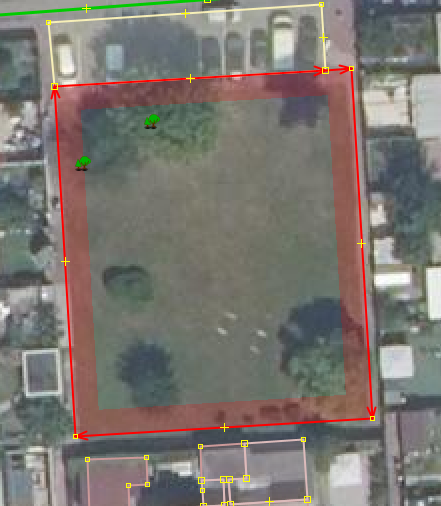
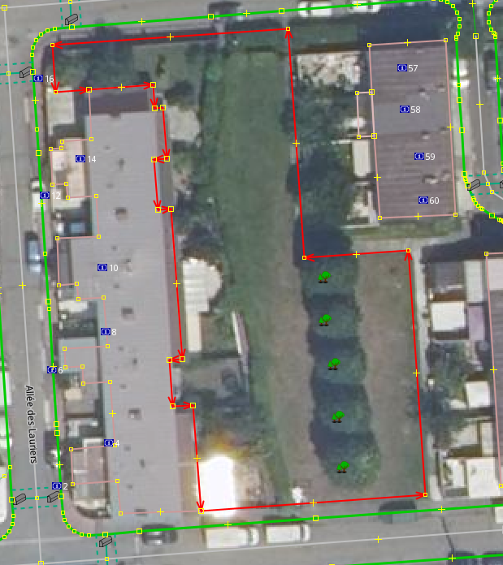
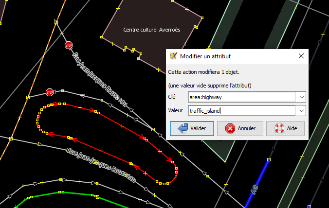
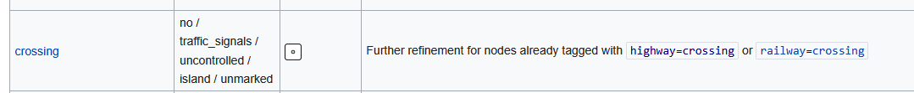
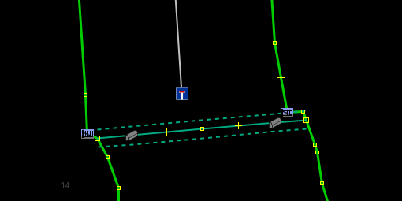
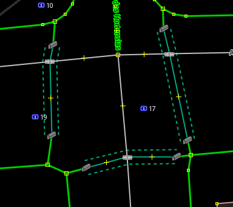
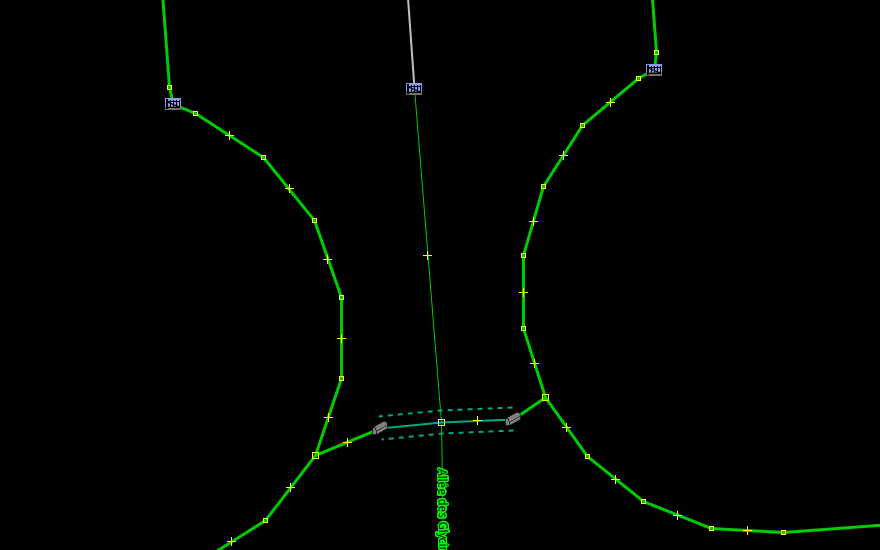
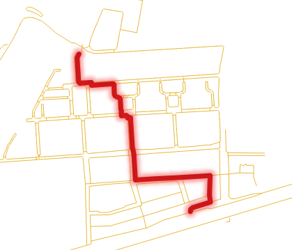
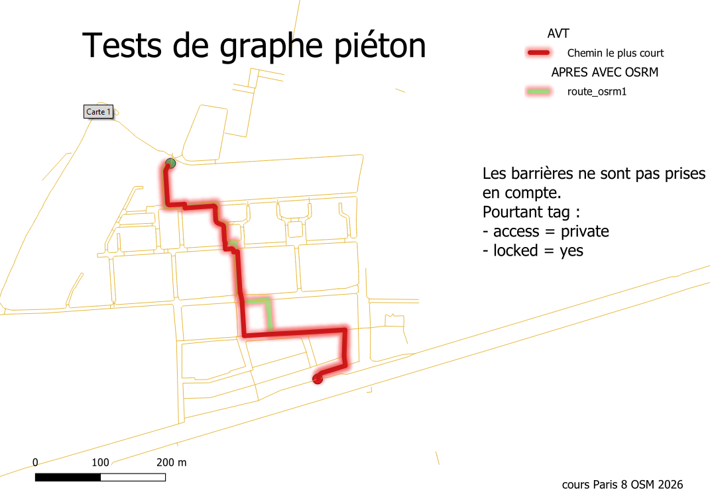

# Objectif

Afin de voir ce qui manque dans notre graphe, on utilise la fonction itinéraire de Qgis

Dans le projet Qgis, on en est à l'étape *saisie 3*



# Intervention communauté OSM

un [commentaire](https://www.openstreetmap.org/changeset/188358162#map=18/48.906946/2.479706)


# Un premier round d'observation

Il convient de revenir sur ce que le plugin a permis de faire en faisant une requête overpass

```         
highway=footway or barrier=*
```

## Dessiner les jardins

Le fait de tracer les trottoirs amènent à tracer de nouveaux objets, par exemple, les jardins.





Pour le raccourci voir la procédure 1

## Changer des tags

Certains trottoirs sont plutôt des ilôts



## Compléter le tag crossing

Enfin, il est possible dés ce niveau de distinguer les passages piétons marqués ou pas.



## 2 manières de figurer un passage piéton

Les 2 plugins utilisés amènent à deux façons de tagger, cela se voit avec la représentation graphique utilisé dans JOSM.





## 2 manières de représenter une porte empêchant le passage

Etre piéton, cela transforme la vision d'une porte fermée




# Utilisation de l'outil plus court chemin dans QGIS

Après avoir fait une premier itinéraire, on modifie notamment les *barrier=gate* en ajoutant et *locked=yes*, on regarde si cela génère autre chose



Encore une carte avant et après :



Quelle est la manière de faire ?

Autre routeur à utiliser : [graphhopper](https://graphhopper.com/maps/?profile=car&layer=Omniscale)

Voir dans le forum, la [discussion](https://forum.openstreetmap.fr/t/comprendre-la-cle-access-et-ses-valeurs-private-surtout/10804)

# En guise de conclusion, ce qu'il reste à faire

3 nouveaux outils

## OSMI

Voir [intervention](https://www.openstreetmap.org/changeset/188074369#map=17/48.909872/2.478018)

D'après le commentaire, utilisation d'[OSMI](https://tools.geofabrik.de/osmi/?view=geometry&lon=2.22781&lat=49.00400&zoom=10&baselayer=Geofabrik%20Standard&overlays=long_ways%2Cways_with_long_segments%2Clong_segments%2Cself_intersection_ways%2Cself_intersection_points%2Csingle_node_in_way%2Cduplicate_node_in_way%2Clong_ways%2Cways_with_long_segments%2Clong_segments%2Cself_intersection_ways%2Cself_intersection_points%2Csingle_node_in_way%2Cduplicate_node_in_way)

## Panoramax

De l'art et de la manière de faire des photos

## Street Complete

Rien ne vaut le terrain en nombre !
