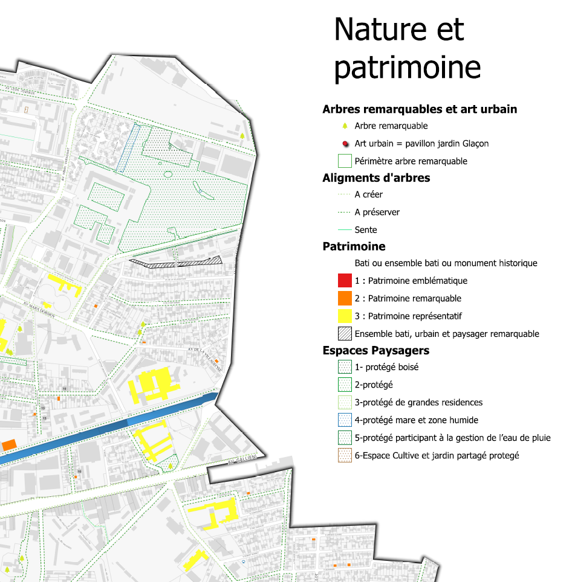

```{r setup, include=FALSE}
knitr::opts_chunk$set(echo = TRUE)
```


# Objectif

## Des cartes électorales à la maille du bureau
  
Fin juin ont été publiés en opendata bureaux de vote et adresse des électeurs (REU), Etalab et data.gouv.fr ont travaillé sur la génération des contours des bureaux de vote.


L'objectif est de vérifier au niveau local le travail d'Etalab puis de croiser résultat des votes et habitat social permettant ainsi une approche fine du territoire avec la *variable lourde* que représente l'habitat social.


## Et OSM dans tout celà ?


Dans OSM, on va améliorer voire mettre en place pour la ville de Bondy :

- les bureaux de vote
- les secteurs de ces bureaux
- les ensembles sociaux (objets du cours de 2022)

{width=300}
*extraction de la carte du patrimoine de Bondy Habitat 2019*

{width=300}
*résultat saisie OSM 2022*

## Remarques diverses

- Etalab / data.gouv.fr

- Pourquoi utiliser OSM ?


# Méthode et déroulé

## Le cercle vertueux

Il s'agit de mettre en place un *cercle vertueux* dans l'utilisation d'OSM : extraire, contribuer, vérifier sa saisie en extrayant de nouveau et contribuer pour l'améliorer.

JOUR 1 : extraction - saisie - contrôle données existantes et ajout des bureaux de vote manquants dans OSM

JOUR 2 : vérification des contours des bureaux, insertion dans OSM, modification des ensembles sociaux éventuellement

JOUR 3 : évaluation de la saisie, puis améliorations et enfin cartographies variées permettant d'éventuelles nouvelles modifications

## Evaluation

Pour chaque séquence, plusieurs cartes et un quizz. pas d'évaluation officielle.

Mais une évaluation collective, de type, combien d'éléments rajoutés dans OSM et un essai de mesure de leur qualité.

Eviter absolument le retour de bâton OSM, notamment pour l'année dernière :

https://forum.openstreetmap.fr/t/landuse-residential-supprime-a-bondy-et-pavillon-sous-bois/9562/9


donc impérativement mettre dans le commentaire de changeset : #Paris8-Bondy2023 et examiner les contributions dans le détail le matin du 3e jour. 

## Le collaboratif

Un mot au sujet du collectif, ce cours est aussi l'occasion de tester une organisation de travail en groupe (c'est la raison d'être d'OSM) donc autant de groupe que de secteurs de bureaux (31)


## Précisions techniques

### Répertoire réseau

Les cartes sont à mettre dans le répertoire réseau "cartes" dans le répertoire indiqué

### Support et procédures

Le support, fait sous R, sert uniquement de "fil rouge".

Les procédures employées sous QGIS sont à rechercher sur internet.


Essai : "Qgis compter les points dans un polygone"
Quel est le menu qui permet de le faire ?

## Déroulé

```{r}
# stats temps / séquence
temps <- read.csv("data/tps.csv")
sum(temps$tps, na.rm=TRUE)
```

10 mn de trop et sans compter les pauses... 15 mn toutes les 1 H 30

Voir également heures de repas et 1er jour

# Présentation en binôme

passé / présent / futur / attentes par rapport OSM / niveau QGIS
fichier framapad, celui qui parle, celui qui écrit
https://lite.framacalc.org/9ilj-coursp8

Ce fichier va permettre de s'attribuer les zones de saisie et toutes les opérations
collaboratives du cours.

```{r}
data <- read.csv("data/etudiant.csv")
table(data$passé)
par(mar = c(8,2,2,2))
barplot(table(data$passé), las = 2)
barplot(table(data$présent), las = 2)
barplot(table(data$futur), las = 2)
```


# Pratique

- prénom et répertoires de cartes

Déposer son image dans github dans le répertoire *img* du dépot *coursP8* avec comme syntaxe : *P8_prenom.png*


- copie du projet GIT en début et en fin de session


- quelle diffusion ?


# Quizz

Introduction
https://framaforms.org/paris8-bondy2023-introduction-1693048391

séquence 1
https://framaforms.org/paris8-bondy2023-basiques-osm-1693075060

séquence 2
https://framaforms.org/paris8-bondy2023-premiere-saisie-1693156617

séquence 3
pas de quizz, car surtout des cartos.

Evaluation de satisfaction
https://forms.gle/R5W9DooDPMmRn3kF6


# Sitographie

## REU et applicatif

La librairie R de l'INSEE

https://inseefrlab.github.io/mapvotr/index.html

https://blog.insee.fr/a-vote-a-chaque-bureau-de-vote-ses-electeurs/

## Analyse électorale

pour la notion de *variable lourde*

https://metropolitiques.eu/Elections-nationales-2022-pour-une-analyse-localisee-du-vote-et-de-ses-enjeux.html


sur l'historique des données, un article de 2012

http://cartelec.univ-rouen.fr/?p=408