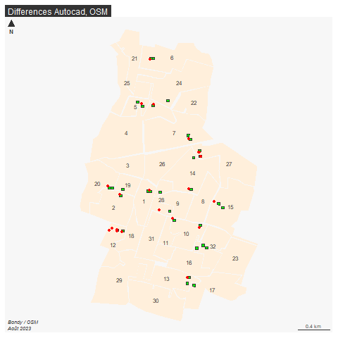
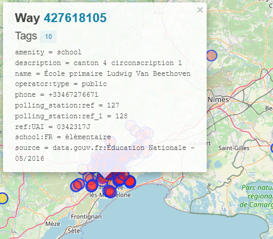

```{r setup, include=FALSE}
knitr::opts_chunk$set(echo = TRUE)
knitr::opts_chunk$set(cache = TRUE)
# Passer la valeur suivante à TRUE pour reproduire les extractions.
knitr::opts_chunk$set(eval = FALSE)
knitr::opts_chunk$set(warning = FALSE)
```


# Objectif

Faire une 1e saisie sous OSM d'un bureau de vote s'il est manquant.

# 1e saisie pour comprendre

## Création du profil

https://www.openstreetmap.org

## Primitives géométriques

## Tag = clé + valeur

https://taginfo.openstreetmap.org/

exercice : faire une saisie sur un point connu

# Extractions diverses OSM : utilisation d'overpass

https://overpass-turbo.eu/

## Première approche : les rues


```
highway = * in Bondy
```

Cela tombe bien, les rues permettent de définir les secteurs des bureaux de vote


### CARTE 1 : les rues OSM sous QGIS

Savoir-faire QGIS : 

- mettre un favori dans l'explorateur sur le répertoire Téléchargement

- intégrer une couche dans Qgis

- étiquetage des rues sous Qgis


résultat


- mise en page qgis (3 boutons)

### Méthode

Que chaque stagiaire essaie de faire la carte en fonction de ce qu'il sait faire.
En amont, remplissage d'un tableau sur les 3 points


## Deuxième approche : les bureaux de vote

### Chercher le tag


Dans overpass, observer la mairie de Bondy, quels sont les tags correspondant au bureau de vote ?

Dans taginfo, constater l'aire d'utilisation des tags et les combinaisons possibles.


### Quelques requêtes

Avec l'assistant, essayer 


```
  - polling_station=yes
  - polling_station_ref=*
  - ~polling~".*"
```

Que signifie la dernière requête ? s'aider de l'aide de l'assistant d'overpass.

Effectuer cette requête sur l'ensemble de la France, que permet-elle de voir ?


# Saisissons !

## CARTE 2 : sources locales, opendata, et OSM sur les bureaux de vote

### Utiliser le vote.gpkg

```{r}
library(sf)
library(mapsf)
st_layers("data/vote.gpkg")
# Combien de bureaux ?
bvAutocad <- st_read("data/vote.gpkg", "bureauxPoly")
bvOpendata <- read.csv("data/bvOpendata.csv")
str(bvOpendata)
# pas de coordonnées, il faut géocoder. Cette liste servira juste de vérification.
zoneAutocad <- st_read("data/vote.gpkg", "bureauPolyZone")
zoneAutocad <- zoneAutocad  [, c("numBureau","bureauNo_1")]
names(zoneAutocad)[2]<-"nom"
st_write(zoneAutocad, "data/vote.gpkg", "bureauPolyZone", delete_layer = T)
zoneMakina <- st_read("data/vote.gpkg", "bvMakina")
```

### Y rajouter une couche d'OSM 

```{r}
bvOSM <- st_read("data/export.geojson")
# attention projection et pb géométrie
bvOSM <- st_transform(bvOSM, crs = 2154)
bvOSM <- st_centroid(bvOSM)
```
 
### Carte sous QGIS


Faire la carte sous QGIS en essayant de repérer les bureaux manquants sous OSM

```{r}
png("img/bv.png")
mf_map(zoneAutocad, col = "antiquewhite1", border = NA)
mf_label(zoneAutocad, var = "numBureau")
mf_map(bvAutocad, col = "green", add = T)
#mf_label(bvAutocad, var = "Layer", col = "green", halo = T, bg= "antiquewhite4",
 #        overlap = F, pos = 2)
mf_map(bvOSM, col= "red",add = T)
mf_layout("Differences Autocad, OSM", credits = "Bondy / OSM\nAoût 2023")
dev.off()
```



### Questionnements auxquels devrait répondre la carte

Les bureaux sont-ils dans les zones ?

Y-a-t-il des bureaux manquants ?

Est-il possible de repérer les manques dans la saisie d'OSM afin de mieux viser les zones à se répartir ?


### Utilisation de Umap pour se répartir le travail.

```{r}
export <- st_transform(zoneAutocad [, c("numBureau", "nom")], crs=4326)
export$etudiant <- NA
st_write(export, "data/exportBV5.geojson")
```


https://umap.openstreetmap.fr/fr/map/paris8-bondy2023_953589


## Fixer les tags

Les deux tags

  - polling_station=yes
  
  - polling_station_ref=*
  
  - s'il y a un 2e bureau de vote sur la même structure, on rajoute polling_station_ref_2
  
  

  

## Les outils OSM du contrôle de qualité

http://resultmaps.neis-one.org

http://osmose.openstreetmap.fr/fr/map/#zoom=16&lat=48.90695&lon=2.49237

et plus...

https://www.maproulette.org/

https://forum.openstreetmap.fr


