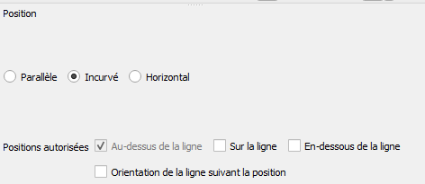
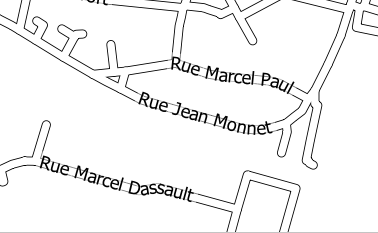

```{r setup, include=FALSE}
knitr::opts_chunk$set(echo = TRUE)
```


# Objectif

Faire une 1e saisie sous OSM d'une résidence
Essayer d'établir une méthode simple

# 1e saisie pour comprendre

## Création du profil

https://www.openstreetmap.org

## Primitives géométriques

## Tag = clé + valeur

https://taginfo.openstreetmap.org/

exercice : faire une saisie sur un point connu

# Extractions diverses OSM

## Overpass pour extraire

https://overpass-turbo.eu/

### Première approche : les rues


```
highway = * in Bondy
```

Cela tombe bien, les résidences sont souvent appelées par le nom de leurs rues...


#### CARTE 1 : les rues OSM sous QGIS

Savoir-faire QGIS : 

- mettre un favori dans l'explorateur sur le répertoire Téléchargement

- intégrer une couche dans Qgis

- étiquetage des rues sous Qgis



résultat




- mise en page qgis (3 boutons)

#### Méthode

Que chaque stagiaire essaie de faire la carte en fonction de ce qu'il sait faire.
En amont, remplissage d'un tableau.


### Deuxième approche : les bâtiments


#### Quelques requêtes

Avec l'assistant, essayer 


```
  - building:owner=*
  - building:levels=*
  - dwellings=*
  - building!~yes and building=*
```
  
Sur différentes échelles (région île de france, bondy)

Que se passe-t-il ? (faire un tableau échelle par requête)


#### L'existant pour building:owner

Trouver les 2 villes pour lesquelles ces tags ont été utilisés.

# Saisissons !

## Les données cadastrales : les personnes morales

Faire une carte Qgis sur la catégorie 5 (La catégorie "5" concerne les bailleurs sociaux.)

### Traitements sur la donnée initiale

```{r}
library(sf)
pmorale <- st_read("data/logement.gpkg", "pmorale")
# on filtre sur la catégorie
categ5 <- pmorale [pmorale$categorie == 5,]
# dénombrement
tab <- table(categ5$nom)
knitr::kable(tab)
# enregistrement du fichier des formes et de la liste des bailleurs.
st_write(categ5, "data/logement.gpkg", "categ5",delete_layer = T)
write.csv(tab, "data/bailleurCadastre.csv")
```

Attention à Bondy Habitat, recoder le fichier de manière à utiliser les mêmes noms et plus courts.

```{r}
txt <- read.csv("data/bailleurCadastreCorrige.csv")
# jointure entre le fichier forme et texte
jointure <- merge(categ5, txt, by.x = "nom", by.y = "nomLong" )
st_write(jointure, "data/logement.gpkg", "categ5",delete_layer = T)
```


### Se répartir les zones

#### Savoir faire QGIS


- utiliser le traitement *de morceaux multiples à morceaux uniques*

On rajoute le prénom de chaque étudiant concerné sur l'objet de saisie


## Fixer les tags

Un seul tag pour cette première saisie 
building:owner = le nom du bailleur foncier propriétaire de la parcelle.
On utilise ID pour saisir.

## Les outils OSM du contrôle de qualité

http://resultmaps.neis-one.org

http://osmose.openstreetmap.fr/fr/map/#zoom=16&lat=48.90695&lon=2.49237

et plus...

https://www.maproulette.org/

https://forum.openstreetmap.fr


