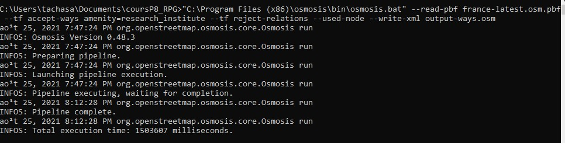

```{r setup, include=FALSE}
knitr::opts_chunk$set(echo = TRUE)
```

# Faire une carte des stations Arvalis (CARTE 1)

## Savoir faire
- mettre un favori dans l'explorateur
- intégrer une couche dans Qgis
- afficher une tuile OSM
- mettre un filtre sur une couche (expression régulière)
- étiquettes
- symbole svg
- chercher les limites régionales et les intégrer


## Résultat


## Méthode

Que chaque stagiaire essaie de faire la carte en fonction de ce qu'il sait faire.
En amont, remplissage d'un tableau.

# Extraire données OSM autour des stations Arvalis

## Overpass

Avec l'assistant, essayer 


```
  - amenity=research_institute
  - name=arvalis
  - name=Arvalis
  - name~valis
```
  
Sur différentes échelles (région île de france, france)

Que se passe-t-il ?

## Osmosis

https://wiki.openstreetmap.org/wiki/Osmosis/Quick_Install_(Windows)

créer un toto.bat et y mettre ce contenu

```{bash, eval=FALSE}
"C:\Program Files (x86)\osmosis\bin\osmosis.bat" --read-pbf france-latest.osm.pbf --tf accept-ways amenity=research_center --tf reject-relations --used-node --write-xml output.osm
```



Environ 1 h

## l'existant pour Arvalis

2 stations

celle de Boigneville (name=Arvalis), et en Bretagne (name=arvalis)


# Contribuer à OSM

## Créer son profil OSM

## Définir les tags

research_institute
name (attention à ce qu'on nomme, penser à la requête sous overpassturbo)

et quoi d'autre ? utiliser taginfo

## Se partager les stations, il y en a 22

dans le framapad chaque étudiant consigne le nom de la station

## Utiliser JOSM

### Paramétrage

F12

### Basiques

* interface
* ajouter / modifier

### Première saisie

### Saisie de la station

### Contrôle de la saisie


