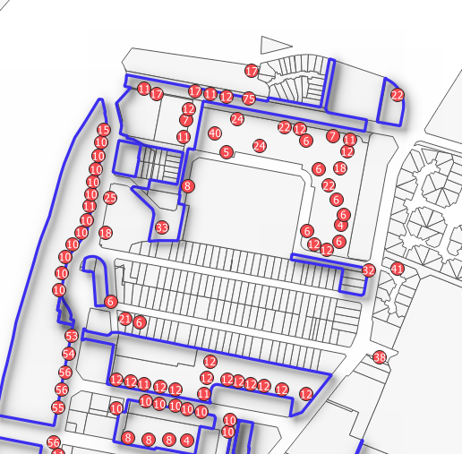

```{r setup, include=FALSE}
knitr::opts_chunk$set(echo = TRUE)
```


# Objectif

Saisir plus d'une résidence avec plusieurs attributs, faire évoluer la méthode de saisie.

On utilise désormais l'éditeur JOSM


# Utiliser JOSM


## Paramétrage F12 pour lien remote

- serveur OSM

Utiliser l'identification simple

- contrôle à distance


## Basiques

* interface (panneaux)
https://wikis.cdrflorac.fr/wikis/CartoEICC/files/TutoJOSM_josm_ui_20170116151152_20170116143347.jpg


## 2 petits exercices JOSM

- exercice 1 : sur un calque vierge, utiliser mode s (sélectionner), a (ajouter), et w (modifier)

- exercice 2 : osmecum *intégrer le bati*

Essayer par exemple de fusionner deux points, un point et une ligne... en suivant les indications de la fiche


## Contrôle de la saisie

Le validateur permet de repérer les erreurs possibles

exercice : sans avoir fait de changement sur une zone, activer le validateur et zoomer sur un objet posant problème.

On s'aperçoit que souvent le validateur est trop rigoureux.

# Préparation


## Définir les tags

utiliser l'osmecum building

https://wiki.openstreetmap.org/wiki/France/Osmecum

que mettre pour le bailleurs social ?

## Se partager les zones

### 2 type de sources : internes et opendata

#### Données internes : l'inventaire de 2013 

##### Les zones

La problématique : que cartographier ?

Rappel : la carte voulue est une carte des résidences, donc on va essayer de cerner ces résidences.

Pour celà nous avons un outil interne à la commune : le répertoire du patrimoine HLM dont on va pouvoir reprendre la sectorisation.


##### Le nom des résidences


```{r}
resid <- read.csv("data/bailleurInventaireCorrigeUTF8.csv", fileEncoding = "UTF-8")
knitr::kable(resid)
```
 
Ce fichier va saisir de base de saisie.

#### RPLS données opendata

##### Définir l'opendata à travers l'exemple de la matrice cadastrale


###### Repères chronologiques

Question : De quand date le principe de libre communication de la matrice cadastrale ?

* loi du 7 messidor an II
* Décret n° 2012-59 du 18 janvier 2012 relatif à la délivrance au public de certaines informations cadastrales qui modifie le livre des procédures fiscales
*	loi du 17 juillet 1978 (dont l’article 6 (protège les secrets de la vie privée)


###### Faire une demande de nom de propriétaire sur france cadastre


###### En guise de conclusion

Voir les commentaires

https://pasq.fr/fichier-des-proprietes-des-personnes-morales

## CARTE 2 : zonage inventaire et RPLS

## Traitements appliqués au RPLS

pour le RPLS au département

Quels traitements faut-il appliquer au RPLS téléchargé ?

```{r, eval=FALSE}
library(sf)
library(mapsf)
data <- read.csv2( "data/RPLS2019_detail_IDF_DEP_93.csv", encoding = "UTF-8")
# 1er traitement
data <- data [data$CODEPOSTAL == '93140',]
# 2e traitement
str(data [, c("longitude", "latitude")])
data <- st_as_sf(data, coords =c("longitude", "latitude"), crs = 4326)
# 3e traitement
st_write(data,"data/logement.gpkg","RPLS4326", delete_layer = T)
```


## Savoir faire QGIS

- charger 2 couches (RPLS et quartiersBailleurs dans le gpkg logement)

- symbologie groupe de points pour le RPLS


- symbologie pour catégorisé pour le quartier en bordure ligne simple


- tuile osm ou rues de la première carte

- mise en page qgis

## Résultat


# Saisissons !

## Définir une méthode

### Quelles informations dans nos sources ?


Donner les sources de cette carte

Examiner le RPLS, que peut-on mettre comme informations ?


### proposition à partir d'un exemple
Qu
A partir d'un exemple sur la carte 25 rue Fontaine :
- on identifie son adresse, son nom, sa hauteur, le bailleur, le nombre d'appartements, l'age.
- on vérifie cohérence hauteur et nb appartements
Dans ce cas, comme il n'existe pas dans le répertoire,  on rajoute la ligne.


# Vérifions !

## Extractions

## CARTE 4 : carte par bailleurs

style catégorisé, reste-t-il beaucoup à saisir... on le fera demain

comparer également avec le tableau

## CARTE 5 : carte en 2,5 sur secteur précis

Jouer avec les paramétrages


extraction d'OSM : https://osmbuildings.org/
