```{r setup, include=FALSE}
knitr::opts_chunk$set(echo = TRUE)
```


# Objectif

Après les bureaux de vote validés, la saisie va se faire sur les secteurs et les résidences sociales.

On utilise désormais l'éditeur JOSM


# Utiliser JOSM


## Paramétrage F12 pour lien remote

- serveur OSM

Utiliser l'identification simple

- contrôle à distance

## Choix de la zone

Trouver les boutons :

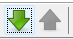

Essayer de télécharger toute la zone de Bondy, que se passe-t-il ?

Partir sur sa zone.

## Basiques

* interface (panneaux)
https://wikis.cdrflorac.fr/wikis/CartoEICC/files/TutoJOSM_josm_ui_20170116151152_20170116143347.jpg

repérer notamment les différents calques et créer un calque vierge pour faire quelques exercices.


* affichage imagerie aérienne

* filtre

On annule les tracés des bâtiments, c'est pratique pour tracer d'autres zones sans en effacer.

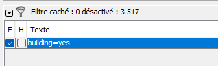

## 3 petits exercices JOSM

- exercice 1 : utiliser mode s (sélectionner), a (ajouter), et w (modifier)

- exercice 2 : osmecum *intégrer le bati*

Essayer par exemple de faire un polygone, d'intégrer un nouveau point afin de pouvoir étirer le polygone.


- exercice 3 : sur le calque OSM, rechercher tous les names, tous les dwellings:owner de sa zone, essayer de repérer dans le tableau des résidences ceux qui sont présents.

## Contrôle de la saisie

Le validateur permet de repérer les erreurs possibles

exercice : sans avoir fait de changement sur une zone, activer le validateur et zoomer sur un objet posant problème.

On s'aperçoit que souvent le validateur est trop rigoureux.

## Commentaire du changeset

Ne pas oublier

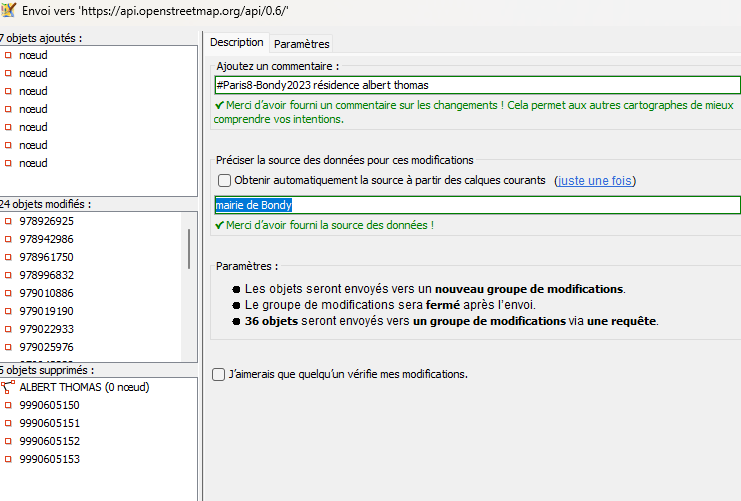

# Préparation


## Définir les tags

Il s'agit d'utiliser un type particulier de primitive OSM : la relation.

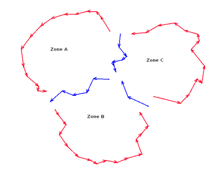

Celle-ci est de type politique (=political)

Quelques questions :

- Que donne une recherche dans overpass : boundary=political ?

- Dans le wiki, https://wiki.openstreetmap.org/wiki/France/Limites_administratives/Tracer_les_limites_administratives

- Combien de fois la valeur *political* est utilisée avec la clé *boundary* (dans taginfo) ?

- au niveau du forum openstreetmap.fr, quelles sont les interventions autour des bureaux de vote ?

## CARTE 3 : zoom sur son secteur

Vérifier les limites de son secteur avec un zoom dessus dans QGIS

Dans Qgis, créer une carte pour sa zone avec les couches suivantes :


Savoirs faire QGIS :

- outil groupe de couches

- algorithme du peintre

- ordonner ses couches en thématiques

- la Couche regroupée est la parcelle cadastrale contenant le bâtiment OSM.

Le résultat est le suivant pour le bureau 1 (hôtel de ville)

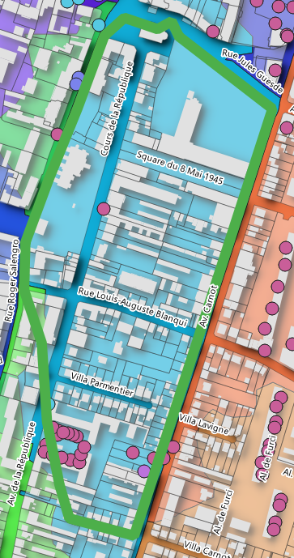 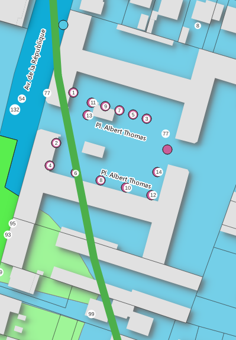

Essayer de reproduire le même type de carte pour son secteur.


## Données internes : l'inventaire de 2013 

### Les zones

Repérer pour son bureau, la zone de logement social concernée

#### Les données

```{r}
library(sf)
st_layers("data/logement.gpkg")
zone<- st_read("data/logement.gpkg", "quartier", quiet=T)
rpls <- st_read("data/logement.gpkg", "RPLS", quiet = T)
```

#### Cartographie

```{r}
library(mapsf)
png("img/zoneInventaire.png")
mf_map(zone)
mf_map(rpls, add = T)
mf_label(zone, "NOM_IRIS", halo = T, cex = 0.8, lines = T, overlap=F, pos = 3)
mf_layout("Zones inventaire bailleurs 2013 et logements sociaux 2021", credits = "Mairie de Bondy, août 2023")
dev.off()
```


#### Bureau d'exemple

Pour le cas du bureau 1, on reconnait la zone * centre ville - gare*

### Le nom des résidences


```{r}
resid <- read.csv("data/bailleurInventaireCorrigeUTF8.csv", fileEncoding = "UTF-8")
# début du fichier
head(resid [resid$rue.si.différente.de.nom.résidence != "",])
# filtre sur le secteur du bureau 1
resid [resid$secteurs == "Secteur Centre Ville/Gare",]
```
 
Il s'agit du début de fichier. La colonne "rue.si..." indique la rue concernée si elle est différente du nom de la cité. Généralement, les résidences portent le nom de la rue qui passe devant l'immeuble.

Le nom de la résidence est bien Albert Thomas.

On cherche à identifier également les autres points non saisis dans OSM en utilisant l'outil identifier de QGIS.

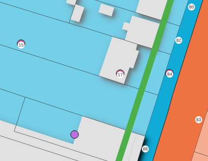
Il s'agit ici du 84 et 88 avenue Carnot. Noter également la position de 15 et du 17 Albert Thomas qui appartiennent à l'ensemble.

Le rpls donne l'année, le nom du bailleur et le nom de la résidence. Ces 3 informations sont également à saisir dans OSM.

Retrouver les tags utilisés par les étudiants de l'année dernière soit sous overpass turbo, soit sous JOSM. Comment faire ?


## Modfication des limites du secteur


### Au niveau des résidences sociales

Dans Qgis, on va utiliser les outils dits de *numérisation* pour modifier son secteur en englobant les résidences sociales exclues des périmètres.

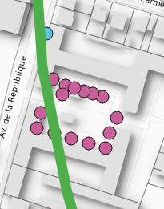 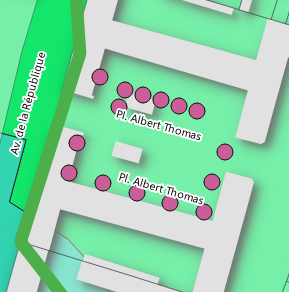

### Au niveau des rues

On pourrait également utiliser le listing des bureaux de vote (découpagePropre.csv) pour vérifier les tracés.


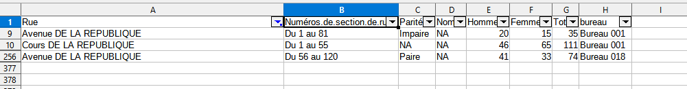

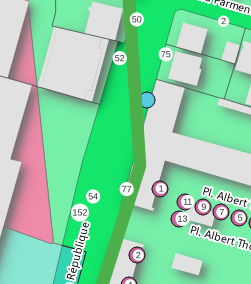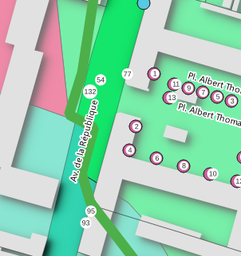

Dans ce cas, on décide de modifier le contour Autocad en suivant celui de Makina.


```{r}
st_layers("data/vote.gpkg")
monSecteur <- st_read("data/vote.gpkg", "monSecteur")
autocad <- st_read("data/vote.gpkg", "bureauPolyZone")
makina <- st_read("data/vote.gpkg", "bvMakina")
png("img/bureau1.png")
mf_map(monSecteur, border = "green")
mf_map(autocad, border = "red",col = NA,add = T)
mf_map(makina, border= "blue", col = NA,add = T)
mf_layout("Modification secteur bureau 1", credits = "Mairie de Bondy, août 2023")
dev.off()
```

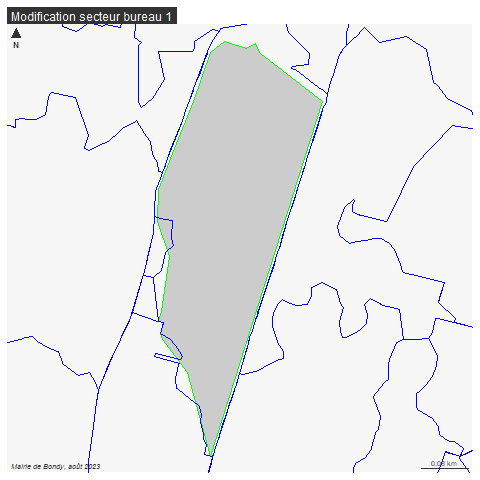

# Saisissons !

Nous avons 2 types de modifications à faire :

- Les résidences sociales manquantes

- le périmètre du bureau de vote à insérer

## Les résidences sociales

Dans le calque OSM, cliquer sur le bâtiment concerné et mettre name, start_date et dwellings:owner.

Dans le framapad, mettre son prénom au niveau de la résidence pour signaler que la saisie a été faite

Exemple pour la résidence Albert Thomas du secteur 1. En fait la clôture avait été saisie avec les bons tags sauf dwellings:owner.

De plus, la clôture était incomplète n'englobant pas les numéros 15 et 17.

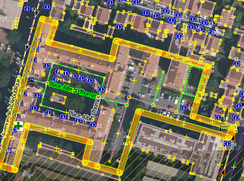


## périmètre bureau de vote

- importer le calque dans JOSM (format geojson et projection 4326)

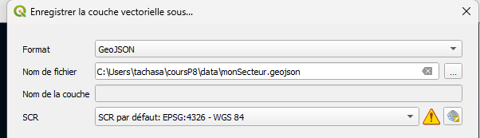

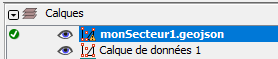

- repérer les tracés (ways) déjà existants et rajouter les autres

- sélectionner l'ensemble des tracés et tagger comme une relation

Dans notre cas, bureau de vote numéro 1, comme c'est le premier, il n'y a pas de 
polygone adjacent, donc la relation est utilisée uniquement pour associer le bureau de vote et le périmètre.

On sélectionne le secteur, et on fusionne sur le calque d'OSM


Le panneau relation est à afficher (Alt + Maj + R)

Les tags sont :

- boundary=political

- political_division=bureau de vote

- source=ville de Bondy

- type=boundary

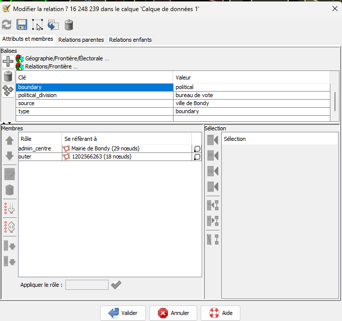

Ne pas oublier de donner le rôle : admin_centre et outer

## Bilan de la saisie

Temps de saisie, 15 mn puis cycles de 30 mn.

A compléter sur retour des étudiants

quantitatif : combien de saisies par étudiants

qualitatif : quelles difficultés ?
