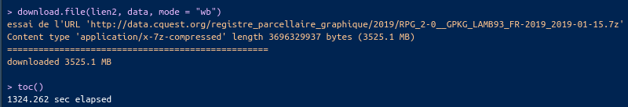
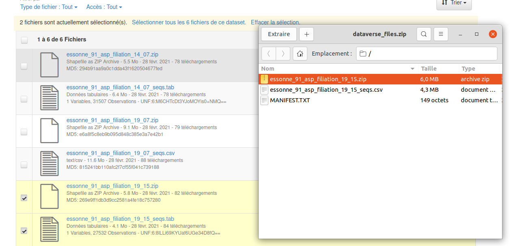
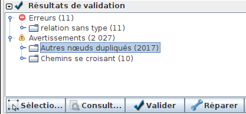
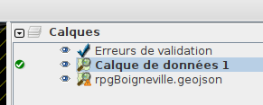
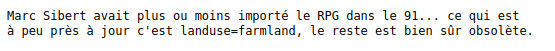

```{r setup, include=FALSE}
knitr::opts_chunk$set(echo = TRUE)
```


```{r}
library(sf)
library(mapsf)
library(tictoc)
```

# Introduction : pourquoi le RPG ?

Le RPG est une donnée libre.

cf liste de discussion osm (https://lists.openstreetmap.org/pipermail/talk-fr/2020-December/subject.html)
avec le mot clé *rpg*

Quelle conclusion retirer de cet échange ?

La solution de facilité serait de faire l'import de tout le RPG mais ce n'est pas
l'esprit d'OSM, les imports automatiques sont très déconseillés.

Aussi, l'objectif ici est, en fonction des zones, de mettre en place différentes
stratégies de saisie.

# Différents types de RPG

## Définir et utiliser le rpg opendata

Essai : télécharger et cartographier

2 questions : où ? combien pèse le fichier ?

```{r, eval = FALSE}
lien <- "https://www.data.gouv.fr/fr/datasets/r/0e28d7bb-c833-4c76-a180-b75f35d417c6"
lien2 <- "http://data.cquest.org/registre_parcellaire_graphique/2019/RPG_2-0__GPKG_LAMB93_FR-2019_2019-01-15.7z"
options(timeout=10000)
tic()
download.file(lien2, destfile='data.7z')
toc()
# temps très long !
res <- unzip("data.7z")
# cela ne marche pas, on le fait hors R
data <- st_read("PARCELLES_GRAPHIQUES.gpkg", "parcelle_graphique",query = "select * from parcelle_graphique limit 10;")
st_write(data, "data/rpg.gpkg", "rpgExtract")
```



à titre de remarque
https://georezo.net/forum/viewtopic.php?id=123178

```{r}
data <- st_read("data/rpg.gpkg", "rpgExtract")
data
```


## Le rpg dans OSM, où est-il présent ?


Essayer avec le tag *source~RPG* sur le département 91


Puis autour de la station Arvalis de Boigneville, que se passe-t-il ?

## RPG de l'INRAE (Carte 2)

https://data.inrae.fr/dataset.xhtml?persistentId=doi:10.15454/XH84QB

Objectif : Quelle information est-intéressante à cartographier ?

Consigne : Télécharger un département où existe une station et cartographier


### Exemple (à ne pas prendre) : Boigneville, département 91

Le traitement est sous R pour l'exemple. 



#### Création du tampon de 5 km

```{r, eval=FALSE}
data <- st_read("data/essonne_91_asp/filiation_19_15.shp")
str(data)
boigneville <- st_read("data/station.shp", query = "SELECT * FROM station where Ville LIKE 'Boigneville' ")
tampon <- st_buffer(boigneville, 5000)
inter <-  st_intersection(tampon, data)
inter <- inter [,"SEQUENCES"]
st_write(inter,"data/rpg.gpkg","rpgBoigneville", delete_layer = T, quiet = T)
```

Le tampon de 5 km génère 1200 polygones. C'est déjà beaucoup.

#### Quelle donnée cartographier ?

```{r}
data <- st_read("data/rpg.gpkg", "rpgBoigneville")
plot(data$geom)
# On cherche l'information à cartographier
str(data)
head(data$SEQUENCES)
# On éclate les chaînes de séquences
ecl <- strsplit(data$SEQUENCES, "= ")
tot <- NULL
for (i in 1:1200){
seq <- ecl[[i]][2]
tot <- c(tot, seq)
}
data$seq <- tot
# On récupère le shéma des cultures sur 5 ans
st_write(data, "data/rpg.gpkg", "rpgBoignevilleSeq", delete_layer = T, quiet = T)
tail(tab <- sort(table(tot)))
(tab2 <- table(tab))
# On mesure la fréquence des shémas
suite <- as.integer(names(tab2))
sum (suite [suite > 9])
# On sauvegarde les sequences qui reviennent au moins 10 fois.
write.csv(tab, "data/cptSeq.csv")
```
Donc, s'il y a beaucoup de séquences uniques, il existe également des séquences qui reviennent plus de 
10 fois. Sur 501 séquences, 341 reviennent plusieurs fois, ce sont celles qu'on va choisir de cartographier.

```{r}
# colonnes concernées
sel <- names(tab [tab > 9])
dataSel <- data [data$seq %in% sel,]
st_write(dataSel, "data/rpg.gpkg", "rpgBoignevilleSeqMaj", delete_layer=T, quiet = T)
```


### Choix d'une cartographie


```{r}
library(mapsf)
data <- st_read("data/rpg.gpkg", "rpgBoignevilleSeq",quiet= T, stringsAsFactors = T)
tab <- read.csv("data/cptSeq.csv")
# jointure
data <- merge(data, tab [, c("tot", "Freq")], by.x = "seq", by.y="tot")
```


```{r}
mf_init(data, theme = "candy", expandBB = c(0,0,0,.15))
mf_shadow(data, add = TRUE)
mf_map(data, var = "Freq", type = "choro", breaks = "jenks", nbreaks = 5,
       col ="Mint", border = NA, lwd = 0.5, leg_pos = "right", leg_val_rnd = 0,
       leg_title = "Fréq des rotations", add = T)
mf_layout(title = "RGPD autour de Boigneville", credits = "Sources : INRAE, 2019\nParis8, août 2021")
knitr::kable(tab [tab$Freq > 9, c(2,3)], row.names = F,
             col.names = c("séquence", "fréquence"))
```


### Autres zones : utilisation de Qgis

La démarche peut donc se résumer ainsi :

- tampon et extraction des parcelles
- choix de l'information à cartographier
- extraction en manipulant la chaîne de caractère du champs SEQUENCES
- cartographie gradué du champs

#### Tampons et extraction sous Qgis

Menu vecteur / géotraitement, items tampon et couper

Enregistrement du fichier avec le nom de la station. Dépôt sur le réseau (afin de
récupérer le tout pour la cartographie en atlas.


#### Déterminer l'information à cartographier

Quelle information veut-on cartographier ?

Utiliser plutôt l'indicateur au début de séquences, pour l'extraire,

```
string_to_array("SEQUENCES", '(',))[0]
to_real(substr("indic2",2,9))

```

#### Cartographie

Propriétés / symbologie / style gradué


Nous sommes désormais familier du jeu de données du RPG de l'INRAE, la question 
est maintenant de savoir comment le saisir dans OSM

# Saisir le RPG INRAE dans OSM

## Définir les tags

3 sources : wiki features, taginfo et overpassturbo

### Explorer la donnée

Faire remonter les types de culture majoritaires, pour Boigneville, c'est blé colza orge mais
Et les tags correspondants sont crop=cereal en majorité

Les autres zones sont peut-être plus diversifiées...

### Etablir la liste

Liste commune sous framapad. 5 tags maximum.

Observer les tags importés, les modifier, ajouter les autres, et surtout un fixme : P8 afin de pouvoir
tout sélectionner après.

### Convertir le rpg extrait en geojson

```{r, eval=FALSE}
data <- st_read("data/rpg.gpkg", "rpgBoignevilleSeq",quiet=T)
data <- st_transform(data,4326)
st_write (data, "data/rpgBoigneville.geojson", quiet = T)
```

L'ouvrir sous josm

## Quoi importer ?

### Nettoyage de la couche

### Niveau géométrique


Josm permet de nettyer rapidement avec le validateur et *réparer*

Utiliser également l'outil de simplification des chemins, sur un seul polygone en faisant varier le paramètre

Observer les géométries, quelles sont les problèmes possibles ?

### Niveau attributaire

Il faut que tous les attributs de la couche soient compatibles avec OSM.

Ne pas oublier un fixme=coursP8


### Attention aux deux couches !



On peut d'abord gérer les couches séparemment afin d'observer ce que l'on  ajouter comme information.

Sur Boigneville, c'est complexe car le rpg a été ajouté... en 2010


cf la discussion de décembre 2020.

Deux directions possibles :

- Repérer les zones ou saisie non effective
- Modifier juste les tags et non pas les géométries si elles correspondent.

Utiliser le validateur avant d'envoyer sur le serveur

Quantifier la saisie : une petite saisie correctement effectuée, vaut mieux qu'un
chargement en masse !

### Saisie : 2 sessions

On travaille sur un calque et on envoie les changements de ce calque (envoyer les
changements depuis *le calque actif*)

Ainsi, le calque importé sert simplement aux changements attributaires et aux 
suppressions de géométrie.

Et le calque geosjon aux ajouts géométriques.


