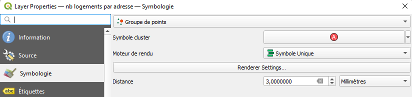
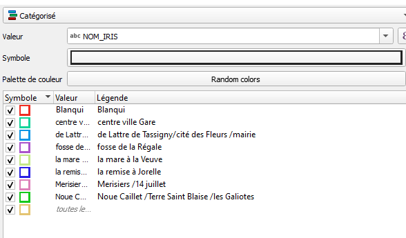
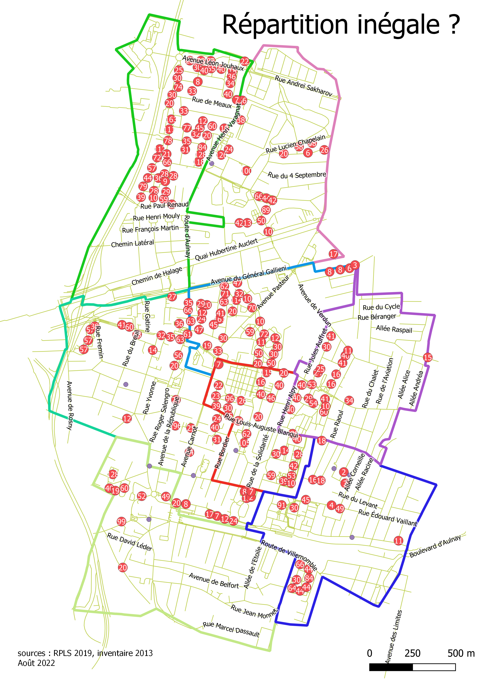

```{r setup, include=FALSE}
knitr::opts_chunk$set(echo = TRUE)
```


# Objectif

Saisir plus d'une résidence avec plusieurs attributs, faire évoluer la méthode de saisie.

On utilise désormais l'éditeur JOSM


# Utiliser JOSM


## Paramétrage F12 pour lien remote

- serveur OSM

Utiliser l'identification simple

- contrôle à distance


## Basiques

* interface (panneaux)
https://wikis.cdrflorac.fr/wikis/CartoEICC/files/TutoJOSM_josm_ui_20170116151152_20170116143347.jpg


## 2 petits exercices JOSM

- exercice 1 : sur un calque vierge, utiliser mode s (sélectionner), a (ajouter), et w (modifier)

- exercice 2 : osmecum *intégrer le bati*

Essayer par exemple de fusionner deux points, un point et une ligne... en suivant les indications de la fiche


## Contrôle de la saisie

Le validateur permet de repérer les erreurs possibles

exercice : sans avoir fait de changement sur une zone, activer le validateur et zoomer sur un objet posant problème.

On s'aperçoit que souvent le validateur est trop rigoureux.

# Préparation


## Définir les tags

utiliser l'osmecum building

https://wiki.openstreetmap.org/wiki/France/Osmecum

que mettre pour le bailleurs social ?

## Se partager les zones

2 type de sources : internes et opendata

- La première va permettre de définir le zonage et de servir de base de saisie

- La deuxième va amener la définition des tags à utiliser


#### Données internes : l'inventaire de 2013 

##### Les zones

La problématique : que cartographier ?

Rappel : la carte voulue est une carte des résidences, donc on va essayer de cerner ces résidences.

Pour celà nous avons un outil interne à la commune : le répertoire du patrimoine HLM dont on va pouvoir reprendre la sectorisation.

```{r}
library(sf)
zone <- st_read("data/logement.gpkg", "quartiersBailleurs")
library(mapsf)
mf_map(zone)
mf_label(zone, "NOM_IRIS", halo = T, cex = 0.8, lines = T)
```


##### Le nom des résidences


```{r}
resid <- read.csv("data/bailleurInventaireCorrigeUTF8.csv", fileEncoding = "UTF-8")
head(resid [resid$rue.si.différente.de.nom.résidence != "",])
```
 
Il s'agit du début de fichier. La colonne "rue.si..." indique la rue concernée si elle est différente du nom de la cité. Généralement, les résidences portent le nom de la rue qui passe devant l'immeuble.
Ce fichier va saisir de base de saisie. Il s'agit de chercher les résidences concernées sur la carte.

#### RPLS données opendata


#####  Découverte du RPLS

CARTE 2 : zonage inventaire et RPLS

##### Traitements appliqués au RPLS

pour le RPLS au département

Quels traitements faut-il appliquer au RPLS téléchargé ?

```{r, eval=FALSE}
library(sf)
library(mapsf)
data <- read.csv2( "data/RPLS2019_detail_IDF_DEP_93.csv", encoding = "UTF-8")
# 1er traitement
data <- data [data$CODEPOSTAL == '93140',]
# 2e traitement
str(data [, c("longitude", "latitude")])
data <- st_as_sf(data, coords =c("longitude", "latitude"), crs = 4326)
# 3e traitement
st_write(data,"data/logement.gpkg","RPLS4326", delete_layer = T)
```


##### Savoir faire QGIS

- charger 2 couches (RPLS et quartiersBailleurs dans le gpkg logement)

- symbologie groupe de points pour le RPLS



- symbologie pour catégorisé pour le quartier en bordure ligne simple


- tuile osm ou rues de la première carte

- mise en page qgis

##### Résultat




##### Définition des tags


D'après l'inventaire, les tags *name* et *building:owner* seront utilisés.
D'après le RPLS, on décide d'utiliser également :

- building_levels

- 


# Saisissons !

Nous avons 2 sources :

- La liste des résidences en .csv qui nous sert de base de saisie

- le contenu du RPLS qui nous permet de remplir les tags

Au bout de quelques saisies, la méthode suivante peut-être envisagée.


## Méthode de saisie

- Choisir une résidence dans le .csv

- Chercher sur la carte Qgis s'il y a des logements correspondant

- si oui, avec l'outil d'identification, chercher l'année de construction et le nombre d'étages (l'étage maximum).

Vérifier également que le nom de la résidence est le même, mais c'est le nom de l'inventaire qui prévaut.

- dans JOSM, repérer l'immeuble ou la résidence concernée et mettre les tags.

Attention, il peut être nécessaire si plusieurs immeubles sont concernés de tracer un polygone et de lui attribuer les tags sauf building:levels qui est propre à chaque immeuble.


- dans le framapad, mettre son prénom au niveau de la résidence pour signaler que la saisie a été faite

## Bilan de l'heure de saisie

- Il est difficile de se repérer géographiquement.

- Les sources RPLS et inventaire pourtant censée être solides ne coincident pas entre elles.

- tagger building:owner sur un polygone qui n'est pas un polygone n'est pas très malin...


