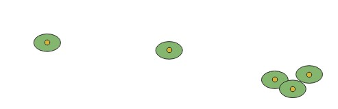

```{r setup, include=FALSE}
knitr::opts_chunk$set(echo = TRUE)
```


```{r}
library(sf)
library(tictoc)
```


# RPG

## Définir et utiliser le rpg opendata

Essai : télécharger et cartographier

2 questions : où ? combien pèse le fichier ?

```{r, eval = FALSE}
lien <- "https://www.data.gouv.fr/fr/datasets/r/0e28d7bb-c833-4c76-a180-b75f35d417c6"
lien2 <- "http://data.cquest.org/registre_parcellaire_graphique/2019/RPG_2-0__GPKG_LAMB93_FR-2019_2019-01-15.7z"
options(timeout=10000)
tic()
download.file(lien2, destfile='data.7z')
toc()
res <- unzip("data.7z")
data <- st_read("PARCELLES_GRAPHIQUES.gpkg", "parcelle_graphique",query = "select * from parcelle_graphique limit 10;")
st_write(data, "data/rpg.gpkg", "rpgExtract")
```


à titre de remarque
https://georezo.net/forum/viewtopic.php?id=123178

```{r}
data <- st_read("data/rpg.gpkg", "rpgExtract")
data
```


## Le rpg dans OSM, où est-il présent


Essayer avec le tag *source~RPG* sur le département 91


Puis autour de la station Arvalis de Boigneville, que se passe-t-il ?

## RPG de l'INRAE (Carte 2)

https://data.inrae.fr/dataset.xhtml?persistentId=doi:10.15454/XH84QB

Consigne : Télécharger un département où existe une station et cartographier

exemple (à ne pas prendre) : Boigneville, département 91


Création du tampon

```{r, eval=TRUE}
data <- st_read("data/essonne_91_asp/filiation_19_15.shp")
str(data)
boigneville <- st_read("data/station.shp", query = "SELECT * FROM station where Ville LIKE 'Boigneville' ")
tampon <- st_buffer(boigneville, 5000)
inter <-  st_intersection(tampon, data)
inter <- inter [,"SEQUENCES"]
st_write(inter,"data/rpg.gpkg","rpgBoigneville", delete_layer = T, quiet = T)
```
Carte du tampon

```{r}
data <- st_read("data/rpg.gpkg", "rpgBoigneville")
plot(data$geom)
ecl <- strsplit(data$SEQUENCES, "= ")
tot <- NULL
for (i in 1:1200){
seq <- ecl[[i]][2]
tot <- c(tot, seq)
}
data$seq <- tot
st_write(data, "data/rpg.gpkg", "rpgBoignevilleSeq", delete_layer = T, quiet = T)
tail(tab <- sort(table(tot)))
(tab2 <- table(tab))
suite <- as.integer(names(tab2))
sum (suite [suite > 9])
```
Donc, s'il y a beaucoup de séquences uniques, il existe également des séquences qui reviennent plus de 
10 fois. Sur 501 séquences, 341 reviennent plusieurs fois, ce sont celles qu'on va choisir de cartographier.

```{r}
# colonnes concernées
sel <- names(tab [tab > 9])
dataSel <- data [data$seq %in% sel,]
st_write(dataSel, "data/rpg.gpkg", "rpgBoignevilleSeqMaj", delete_layer=T, quiet = T)
```


Style catégorisé sous Qgis


# RPG et tampons

## Utilisation de Qgis

### Faire un tampon sous Qgis



### Extraction de données


## Consigne

Faire des tampons de 5 km autour des stations, y extraire le RPG de la zone
Procédure pas à pas à définir

# Saisir le RPG

## Définir les tags

### Liste OSM : mot clé rpg

### Etablir la liste

## 2 saisies / 2 contrôles

- Définir les critères.
- Comment quantifier la saisie ?

## Cartographier sa saisie (carte 3)