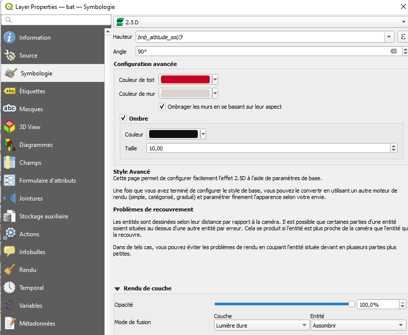

```{r setup, include=FALSE}
knitr::opts_chunk$set(echo = TRUE)
```

# Objet

Il s'agit d'essayer de faire une saisie exhaustive puis de l'exploiter avec les
outils qgis d'atlas et de rapport (cartographie par secteur et par bailleurs.)


# Vérifions la saisie du jour 2

## Extractions avec overpass turbo

Quels tags allons nous utiliser ?

## CARTE 3 : carte pour la 3e saisie

- style catégorisé, reste-t-il beaucoup à saisir ?

- comparer également avec le tableau pour voir si la saisie annoncée correspond à la 
saisie récupérée.

## CARTE 4 : carte en 2,5 sur secteur précis

Jouer avec les paramétrages




extraction d'OSM : https://osmbuildings.org/


# Troisième saisie

## Simplifier le RPLS

Il s'agit avant tout de changer de méthode.

Au final, seules 3 informations nous intéressent dans le RPLS, le nombre d'étages, l'année de construction (le nom de la résidence éventuellement).

Nous allons donc simplifier le fichier RPLS.

Nous avons également remarqué qu'il y avait incohérence entre les 2 sources.

Essayons de partir uniquement du RPLS modifié.
Nous rajouterons le tag *source=rpls2019*

Enfin, nous introduisons la clé *dwellings* qui correspond au nombre d'appartements (colonne appartements)

Donc :

- name

- building:levels

- start:date (colonne construction)

- dwellings (appartements)

- source = rps2019

```{r, eval=FALSE}
library(sf)
rpls <- st_read("data/logement.gpkg", "RPLS")
# Pour une adresse, on aura un point
rplsSimplifie <- aggregate(rpls [,c("NUMAPPT")], by = list(rpls$NUMVOIE, rpls$NOMVOIE, rpls$COMPLGEO), length)
# renommer les colonnes
names(rplsSimplifie) [1:4] <- c("num", "voie", "residence", "appartements")
```

On peut également extraire l'étage maximum pour chaque immeuble, et l'année de construction.


```{r, eval=FALSE}
nbEtage <- aggregate(rpls$ETAGE, by = list (rpls$NUMVOIE, rpls$NOMVOIE, rpls$CONSTRUCT), max)
names(nbEtage) <- c("num", "voie", "construction", "etage")
# jointure avec le 1er fichier
jointure <- merge(rplsSimplifie, nbEtage, by = c("num", "voie"), all.x = T)
st_write (jointure,"data/divers.gpkg","rplsSimplifie",delete_layer=T)
```


## Nouvelle méthode à partir du RPLS simplifié

On ouvre Qgis, on filtre sur son nom dans la couche "pointsDansZone"

On utilise l'outil pour identifier

On repère le bâtiment dans JOSM et on met les 5 tags.


## Résultat de la saisie

On utilise la fonction atlas pour faire les cartes


###  CARTE 5 : La base fonction d'atlas

https://www.qgistutorials.com/fr/docs/automating_map_creation.html

Attention deux éléments de paramétrage

- Onglet atlas à paramétrer 
- Dans les propriétés de la carte (contrôlé par l'atlas)

Quelques expressions à caser :
[%'Page '||@atlas_featurenumber || '/' || @atlas_totalfeatures%]


# Bonus : atlas thématique et rapport

## Atlas thématique

https://naturagis.fr/qgis/atlas-repartition-especes-qgis/

La couche thématique peut-être celle des noms de bailleurs.

## Rapport

Le Rapport fait la même chose que l'atlas thématique (section de groupe de champ).

https://docs.qgis.org/3.10/fr/docs/user_manual/print_composer/create_reports.html


